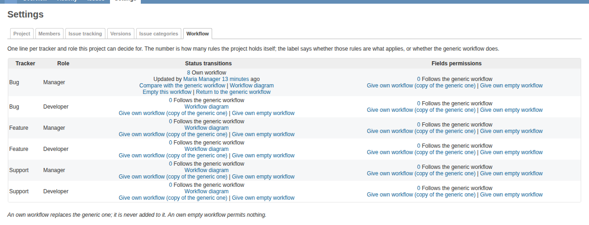
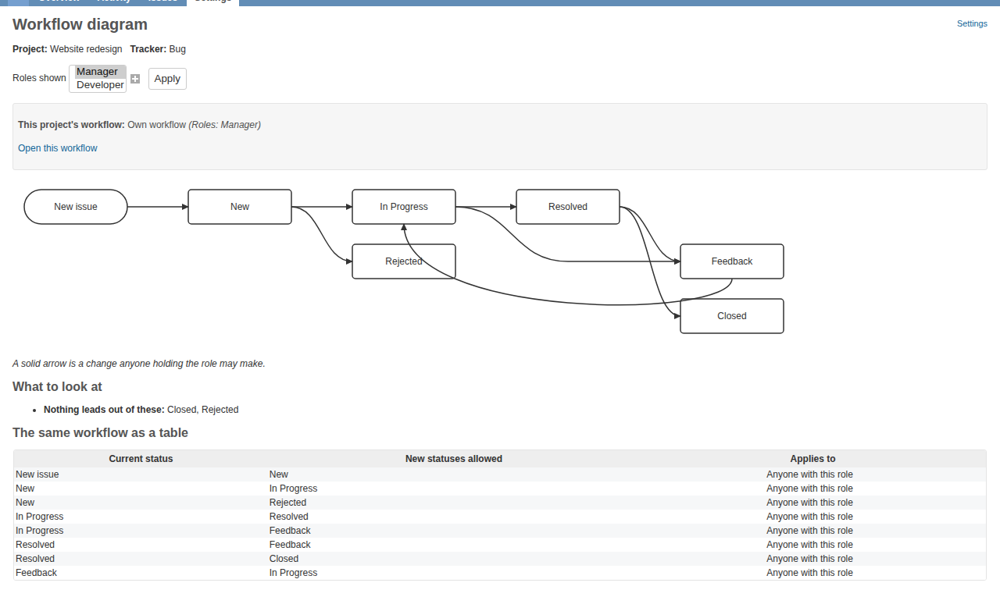

# Project Workflows for Redmine

Redmine has one workflow per tracker and role, shared by every project — the
*generic* workflow. This plugin lets a project run its own instead, without
changing what any other project does.

It adds a nullable `project_id` to Redmine's `workflows` table. Rows without one
are the generic workflow and behave exactly as before; rows with one belong to
that project and **replace** the generic rules for the tracker and role they
cover.



> **Please read this before installing.** This plugin is new. Every supported
> combination of Redmine version and database is tested on every push, with a
> suite of over 1,300 examples — but it has not been through a wide range of real
> production installations, and CI is not the same thing. What it changes is
> **workflow rules, which are authorization**: which status changes your users
> may make and which fields they may edit.
>
> Try it on a copy of your database first, with your own trackers, roles and
> statuses, and read [Things that surprise people](docs/gotchas.md). Take a
> backup before you upgrade or remove it — the plugin ships a documented
> procedure for both. If you hit something, a bug report with your
> Redmine version, your database and what you did is worth far more than one
> without them.

## What you get

- Per-project **status transitions** and **field permissions**.
- A **Workflow** tab in project settings, so a project manager can run their own
  workflow without an administrator. Behind two permissions.
- An **inventory** answering which projects have taken a workflow over, and a
  **comparison** screen showing exactly how one differs from the generic workflow.
- A **workflow diagram** — boxes and arrows — for any tracker and role, with the
  unreachable statuses and the dead ends named rather than just drawn.

  

- A **Workflow for this issue** panel on the issue form: which workflow governs
  you, what this issue may move to, and why something the workflow permits is not
  on offer right now.
- Row and column actions on every matrix, reaching the mixed cells Redmine's own
  check-all toggle skips, with a count of what changed and an **Undo**.
- Bulk saves that write in batches rather than one statement per rule.

## Requirements

- **Redmine 5.1, 6.1 and 7.0** are tested, each against **PostgreSQL, MySQL and
  MariaDB**, on **Ruby 3.2** (Redmine 5.1) and **Ruby 3.3** (6.1 and 7.0). Nine
  combinations, all green before a change lands.
- 5.1 is the declared minimum. There is no declared maximum, so the plugin
  installs on a newer Redmine and tells you whether anything it depends on has
  changed — see [Compatibility](docs/compatibility.md).
- The only dependency is `deface` (`~> 1.9`), which most Redmine installations
  already have.

## Installing

```
# from your Redmine root, with the plugin in plugins/redmine_project_workflows
bundle install
RAILS_ENV=production bundle exec rake redmine:plugins:migrate NAME=redmine_project_workflows
```

Then restart Redmine.

`RAILS_ENV` is not optional: Redmine's plugin migration task defaults to
*development*, so leaving it off migrates the wrong database and reports success.
The migrations add a column and four indexes to `workflows` and create two small
tables; [docs/operations.md](docs/operations.md) has the detail, including what
to expect on a large MySQL installation.

## Getting started

1. **Grant the permissions.** In **Administration → Roles**, under *Issue
   tracking*, give the roles that should manage their own workflows *View the
   project's workflow* and *Manage the project's workflow*. Skip this if only
   administrators will use the plugin.

2. **Open a project's Workflow tab.** Project settings now has one. It lists
   every tracker and role combination the project can decide for, and each starts
   out following the generic workflow.

3. **Give one of them its own workflow.** *Give own workflow (copy of the generic
   one)* copies the generic rules so you can edit from a working starting point.
   *Give own empty workflow* starts from nothing, which permits nothing — useful,
   but not where to begin.

4. **Edit it.** Click the rule count to open the matrix. It is Redmine's own
   grid, with a panel above it saying which workflow you are looking at.

5. **Check what you changed.** *Compare with the generic workflow* lists the
   differences in both directions. *Workflow diagram* draws the result.

To edit many projects at once, use **Administration → Project workflows**. That
screen takes a selection of trackers, roles and projects, with the generic
workflow as one more entry in the list.

## The one rule to learn first

**A project's own workflow replaces the generic one. It is never added to it.**

Once a project has taken a tracker and role over, the generic rules for that
combination do not apply at all — not as a fallback, not for the transitions the
project did not mention. That is why *Give own workflow* starts from a copy.

Two consequences that catch people out:

- **An own empty workflow permits nothing**, and on the issue form that means the
  Status field is not there at all. That is Redmine's own rendering: it shows the
  field only when at least one status is allowed. The *Workflow for this issue*
  panel is the only place that explains it.
- **Nothing is inherited between projects.** A subproject does not get its
  parent's workflow. Use the copy screen to apply one workflow to several
  projects.

[docs/gotchas.md](docs/gotchas.md) is the full list of things that surprise
people — worth five minutes before you roll this out. [docs/usage.md](docs/usage.md)
has the rest of the screens, including what a multi-project selection means when
you save.

## Documentation

| | |
|---|---|
| [Using it](docs/usage.md) | The screens, the three states, editing several projects at once, the diagram, the issue-form panel |
| [Things that surprise people](docs/gotchas.md) | The consequences of the design that catch people out |
| [Settings](docs/settings.md) | The five settings, the write limits and how fast a bulk save is |
| [Installing, upgrading, backing up and removing](docs/operations.md) | Migrations, upgrades from 0.0.3, the backup and restore tasks, uninstalling |
| [Compatibility](docs/compatibility.md) | Supported versions, what happens on an untested Redmine, the diagnostics page |
| [Design](docs/design.md) | How the plugin decides which workflow applies |

## Removing it

Reverse the migrations **before** deleting the plugin directory, and take a
backup first — reversing them deletes every project-specific rule.

```
RAILS_ENV=production bundle exec rake redmine_project_workflows:uninstall \
  FILE=/var/backups/project-workflows.json CONFIRM=yes
```

That backs up, reads the backup back, and only then migrates down. See
[docs/operations.md](docs/operations.md) for what it discards and how to come
back afterwards.

## Contributing

Bug reports and pull requests are welcome. Please include your Redmine version
and database.

Running the tests, from your Redmine root:

```
RAILS_ENV=test bundle exec rspec plugins/redmine_project_workflows/spec
```

[`dev/README.md`](dev/README.md) explains how to build a throwaway Redmine host
for any supported version and database, and [`dev/e2e/`](dev/e2e/README.md) holds
browser scenarios for the screens. If you work on this with an AI coding agent,
start with [`CLAUDE.md`](CLAUDE.md) and [`docs/STATE.md`](docs/STATE.md).

## Licence

GPL-3.0. See [LICENSE](LICENSE).
