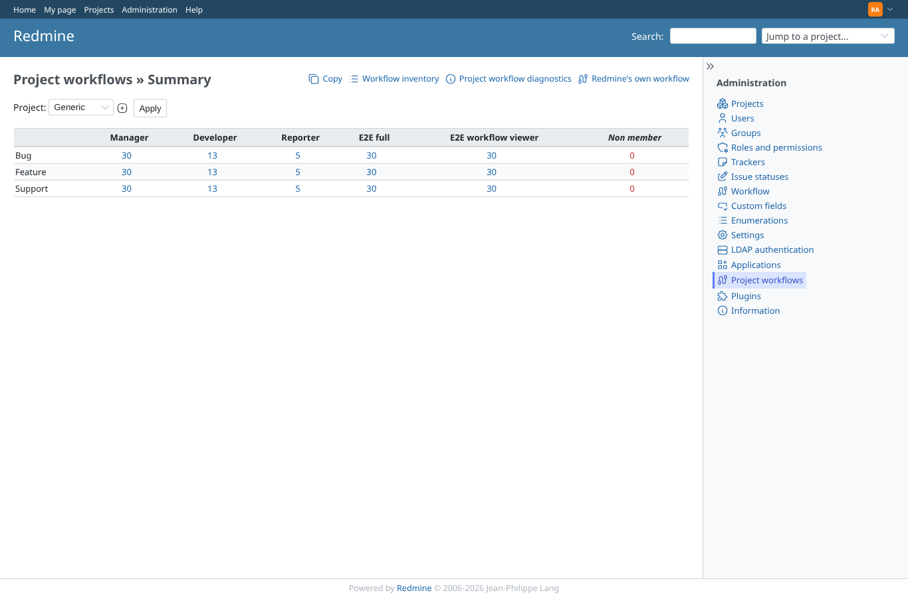
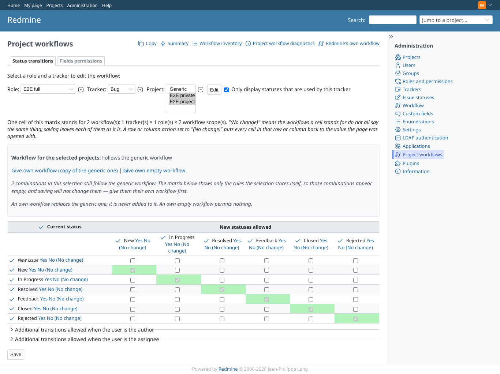
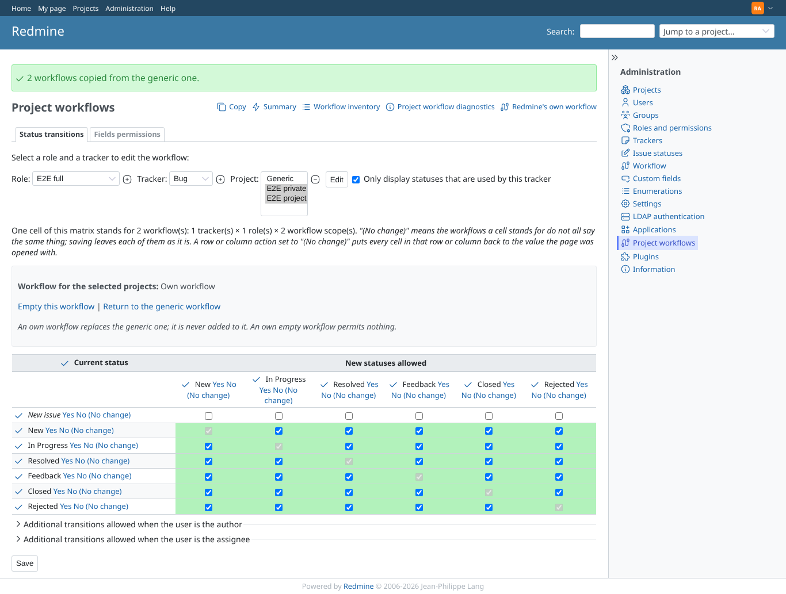
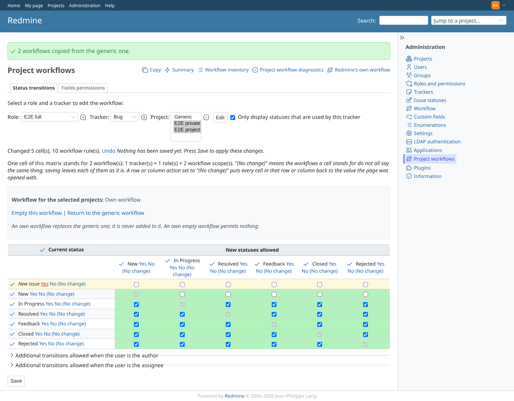
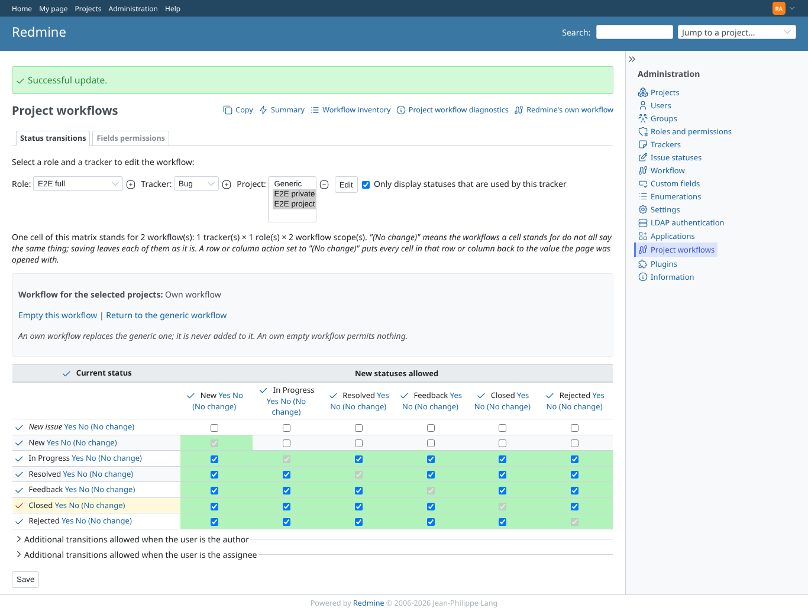
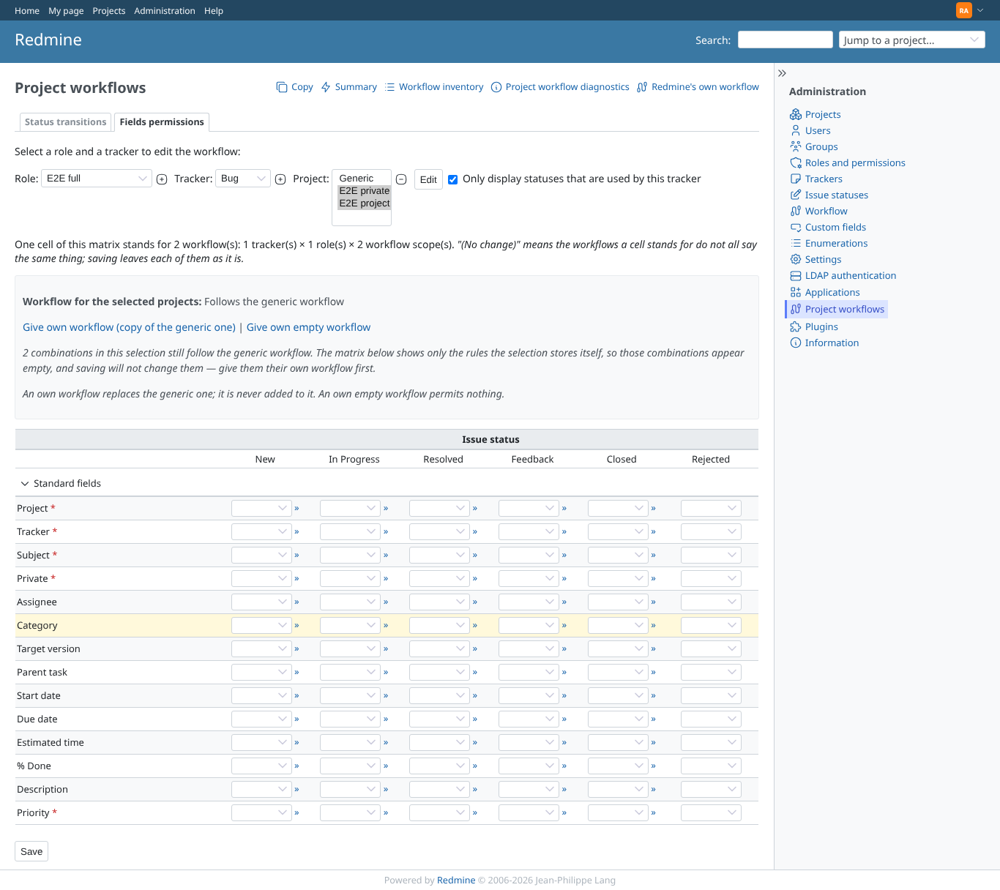
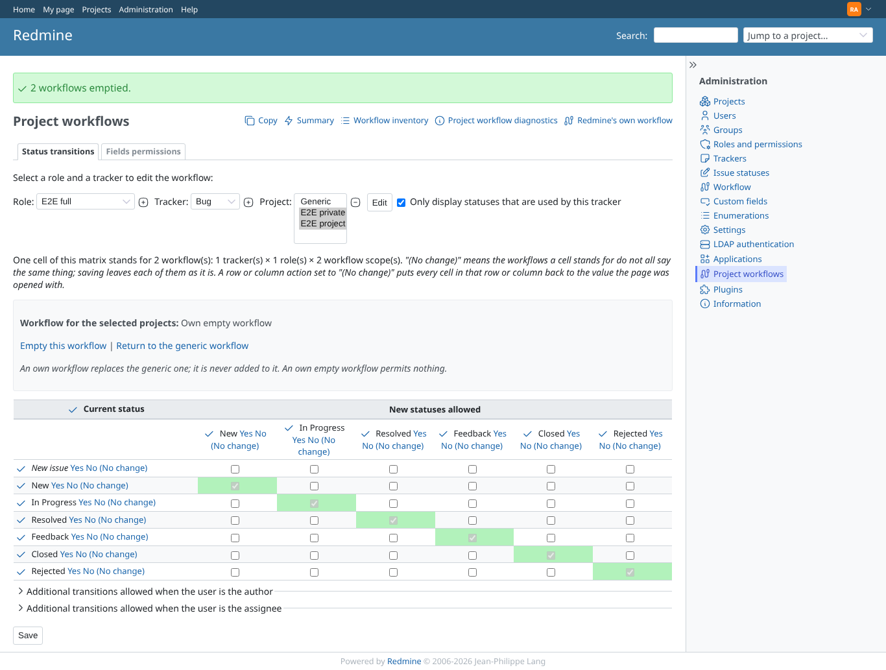
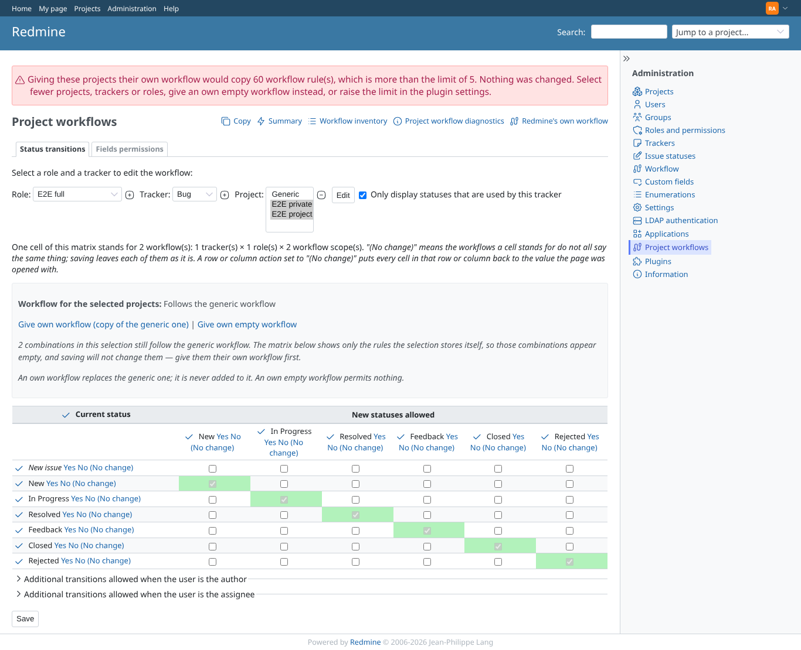
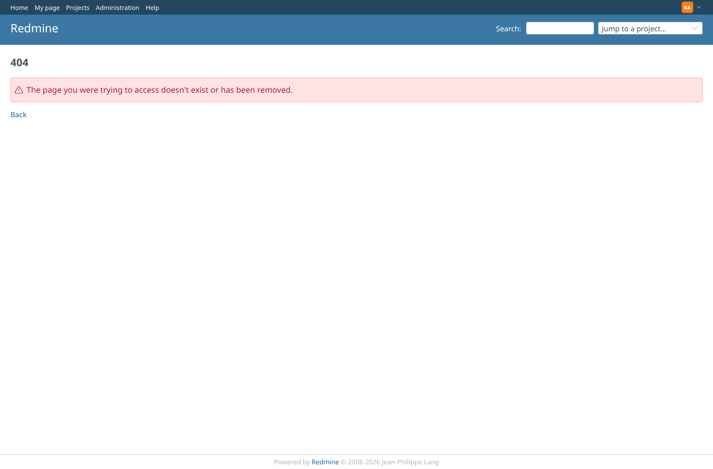

# admin_rules

Run 2026-10-06T20:55:23.774Z against http://127.0.0.1:3000.

| screenshot | user | URL | shows |
|---|---|---|---|
|  | admin | `/admin` | Admin: "Project workflows" in the administration menu |
|  | admin | `/project_workflow_rules` | Admin: Project workflows summary (generic), counts per tracker and role |
|  | admin | `/project_workflow_rules/edit?tracker_id[]=1&role_id[]=6&project_id[]=1&project_id[]=2` | Admin: transitions matrix over e2e-project and e2e-private, both follow the generic workflow |
|  | admin | `/project_workflow_rules/edit?project_id%5B%5D=2&project_id%5B%5D=1&role_id%5B%5D=6&tracker_id%5B%5D=1` | Admin: both projects now have an own workflow; the matrix is editable for the selection |
|  | admin | `/project_workflow_rules/edit?project_id%5B%5D=2&project_id%5B%5D=1&role_id%5B%5D=6&tracker_id%5B%5D=1` | Admin: the New row set to No by one click; the counter says "Changed 5 cell(s), 10 workflow rule(s). Undo Nothing has been saved yet. Press S" |
|  | admin | `/project_workflow_rules/edit?project_id%5B%5D=2&project_id%5B%5D=1&role_id%5B%5D=6&tracker_id%5B%5D=1&used_statuses_only=` | Admin: after Save, the New row is empty for both projects |
|  | admin | `/project_workflow_rules/permissions?tracker_id[]=1&role_id[]=6&project_id[]=1&project_id[]=2` | Admin: field permissions matrix over the two projects (inheriting, Save leaves them alone) |
|  | admin | `/project_workflow_rules/edit?project_id%5B%5D=2&project_id%5B%5D=1&role_id%5B%5D=6&tracker_id%5B%5D=1` | Admin: both projects own EMPTY workflows |
|  | admin | `/project_workflow_rules/edit?project_id%5B%5D=2&project_id%5B%5D=1&role_id%5B%5D=6&tracker_id%5B%5D=1` | Admin: with bulk_write_ceiling = 5, giving two projects a copy of the generic rules is refused before anything is written |
|  | admin | `/project_workflow_rules/edit?tracker_id[]=1&role_id[]=6&project_id[]=999999` | Admin: a selection naming a tracker that does not exist answers 404 |
|  | outsider | `/project_workflow_rules/edit?tracker_id[]=1&role_id[]=6&project_id[]=1&project_id[]=2` | Manager (every project permission, not an administrator): the administration area answers 403 |
|  | anonymous | `/login?back_url=http%3A%2F%2F127.0.0.1%3A3000%2Fproject_workflow_rules` | Anonymous: the administration area redirects to the login page |
