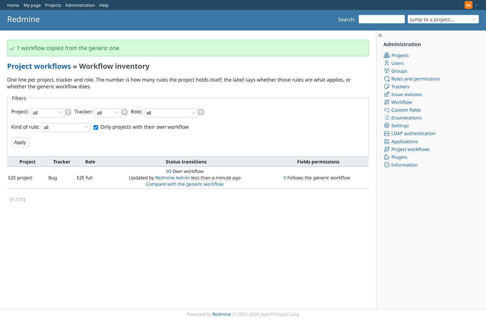
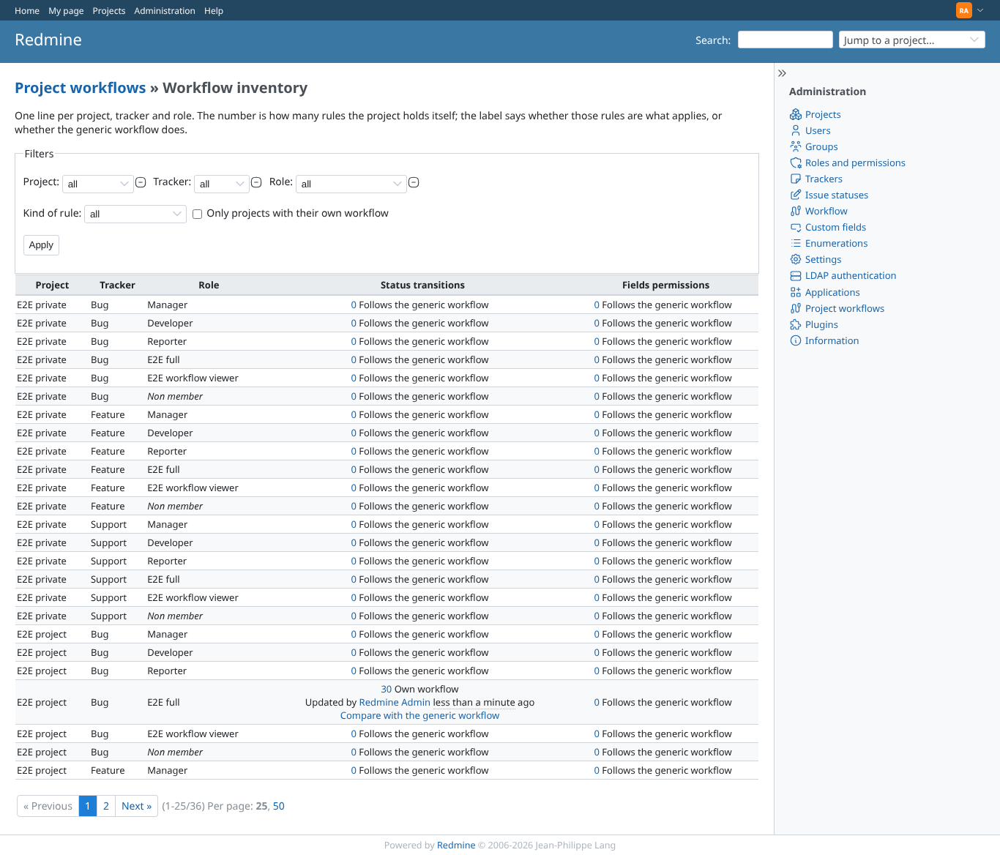
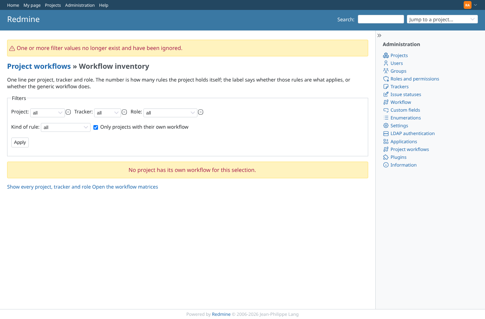
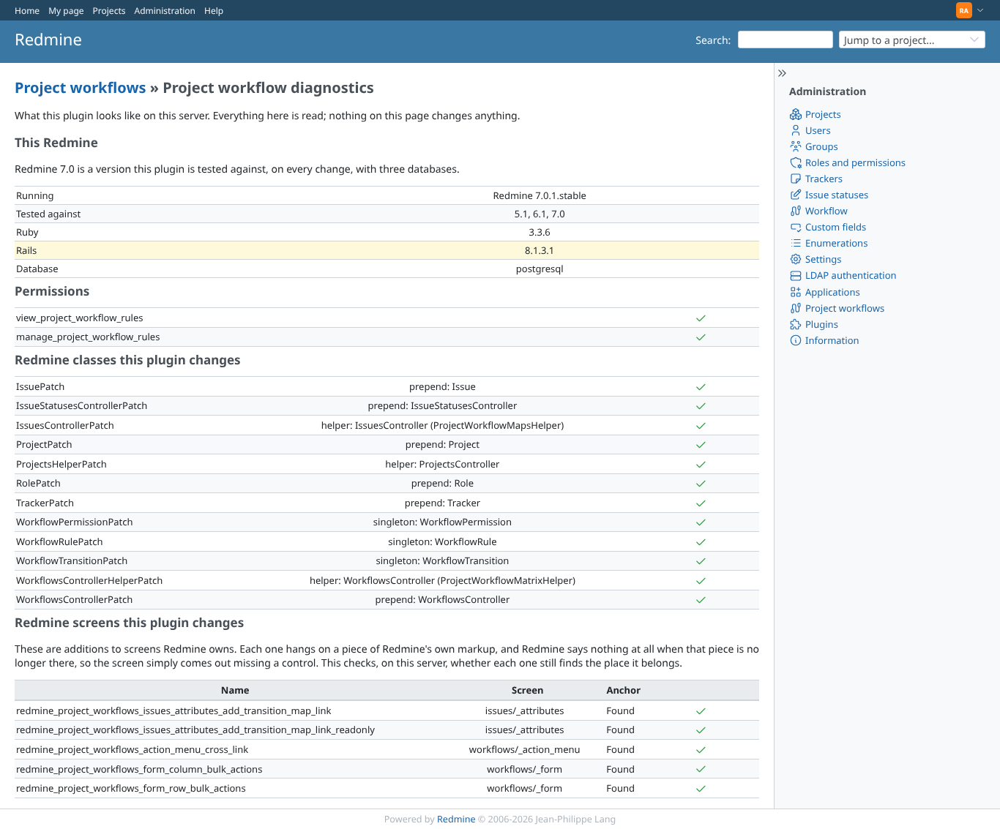
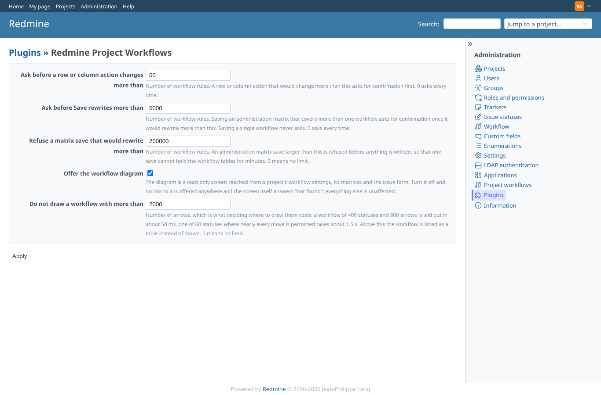
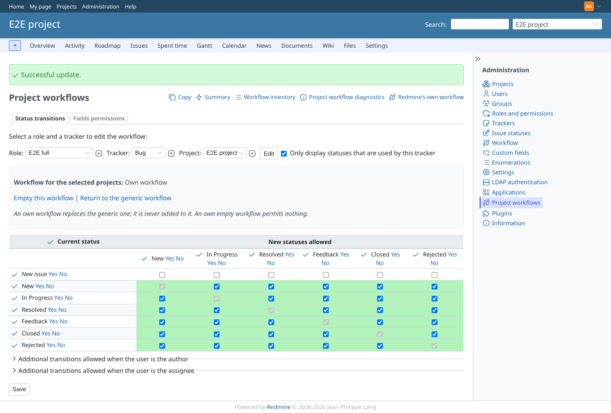
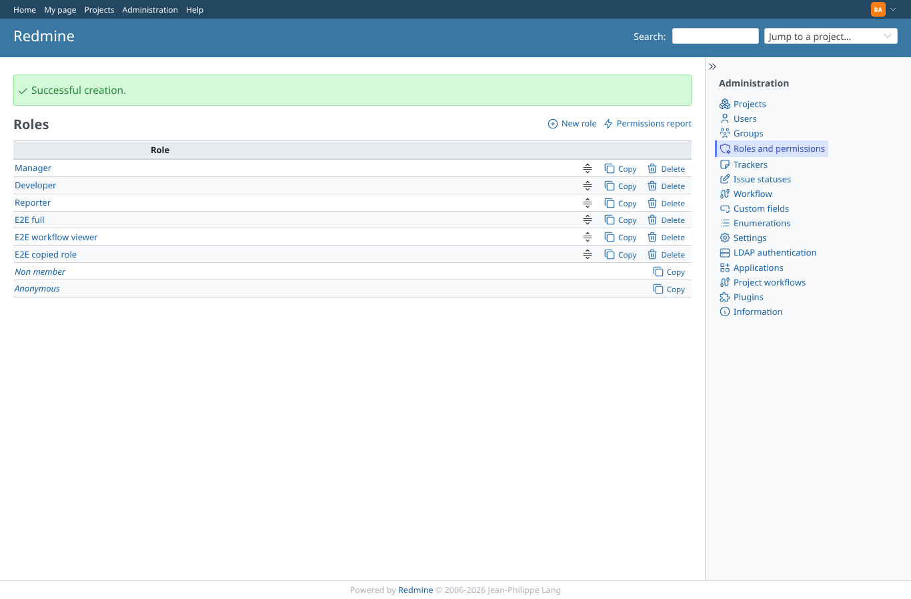
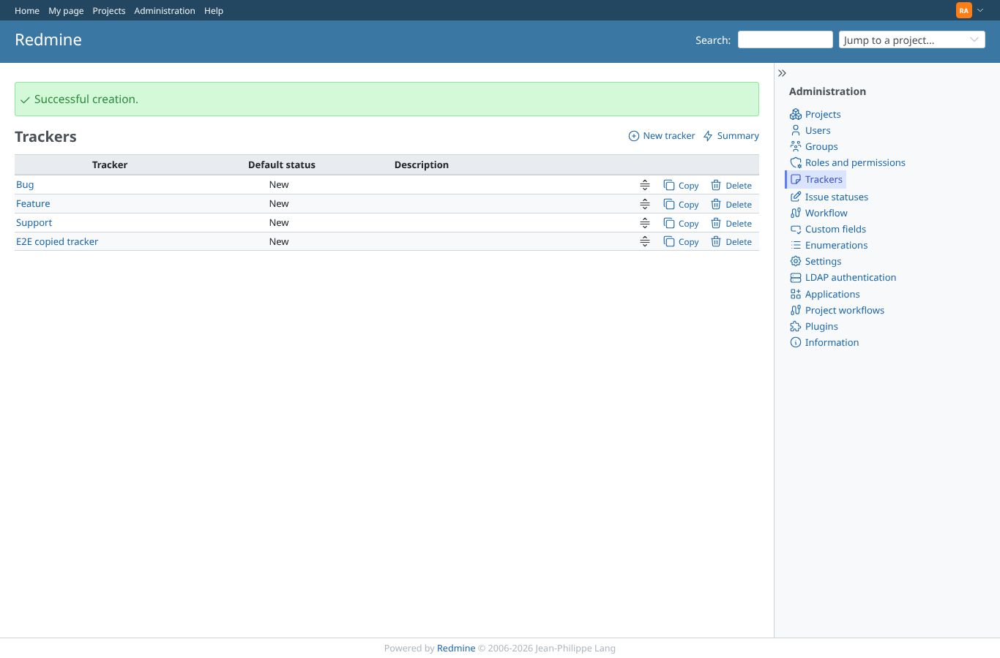
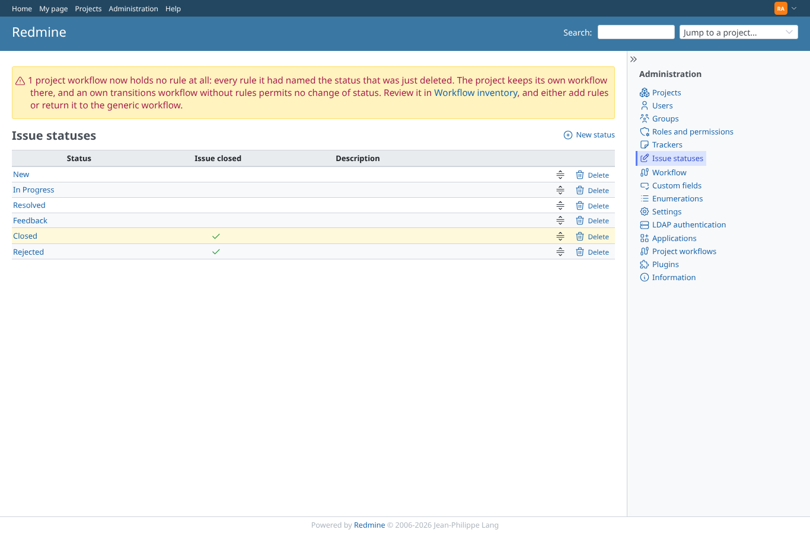

# admin_tools

Run 2026-10-06T20:56:35.057Z against http://127.0.0.1:3000.

| screenshot | user | URL | shows |
|---|---|---|---|
|  | admin | `/project_workflow_inventories` | Admin: the workflow inventory, showing e2e-project Bug x E2E full as an own workflow |
|  | admin | `/project_workflow_inventories?deviations_only=0` | Admin: the inventory with "only deviations" off lists every project |
|  | admin | `/project_workflow_inventories?project_id[]=999999` | Admin: the inventory filtered on a project id that names nothing shows a warning |
|  | admin | `/project_workflow_diagnostics` | Admin: diagnostics on Redmine 7.0.1, every patch and Deface anchor matched |
|  | admin | `/settings/plugin/redmine_project_workflows` | Admin: plugin settings with their defaults |
|  | admin | `/project_workflow_rules/edit?tracker_id[]=1&role_id[]=6&project_id[]=1` | Admin: after saving "abc" as threshold the matrix still works (threshold 50) |
|  | admin | `/roles` | Admin: role copied with "Copy workflow from" E2E full |
|  | admin | `/trackers` | Admin: tracker copied with "Copy workflow from" Bug |
|  | admin | `/issue_statuses` | Admin: deleting a status used by a project workflow shows a warning with a link to the inventory |
|  | manager | `/settings/plugin/redmine_project_workflows` | Manager: inventory, diagnostics and plugin settings answer 403 |
