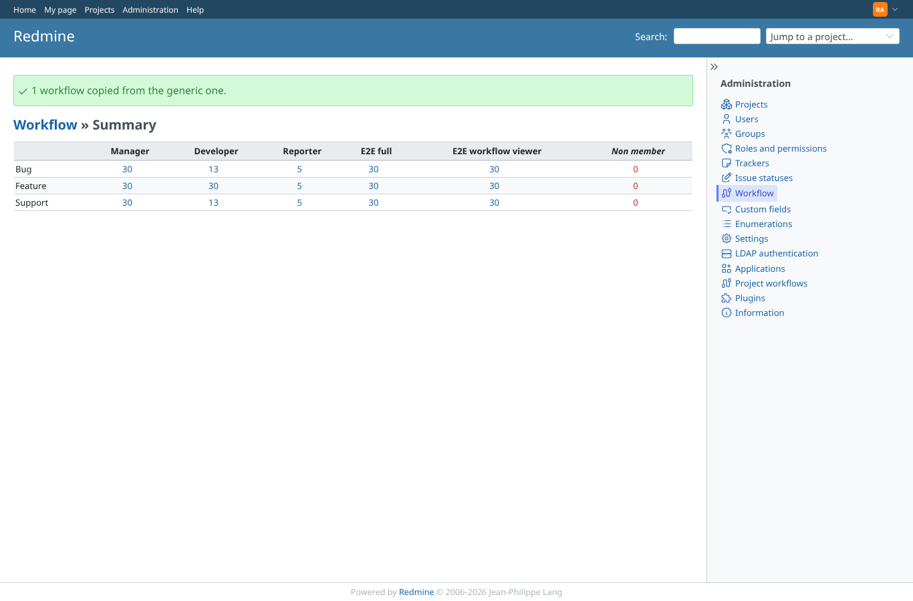
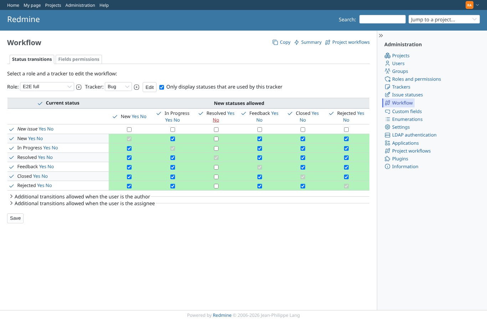
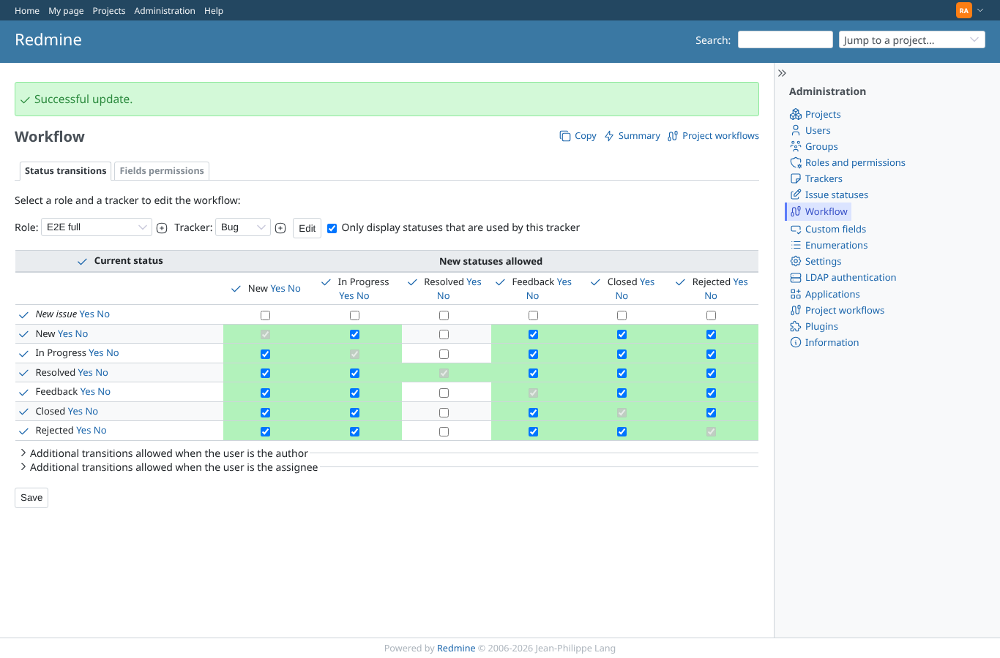
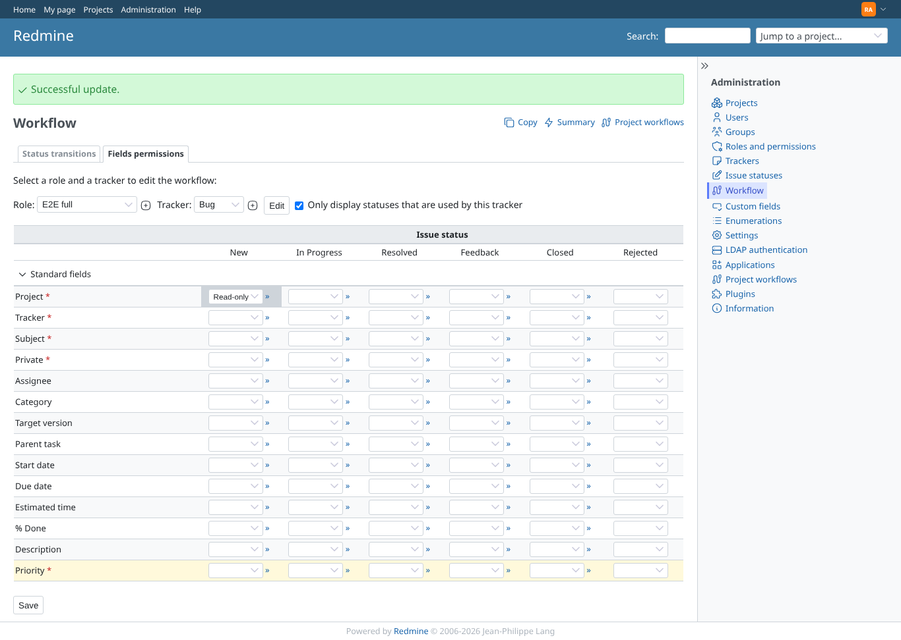
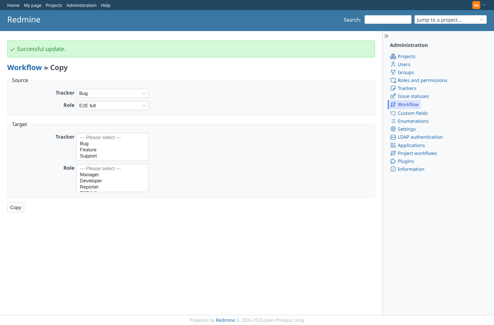

# core_workflow

Run 2026-10-06T20:01:12.187Z against http://127.0.0.1:3000.

| screenshot | user | URL | shows |
|---|---|---|---|
|  | admin | `/workflows` | Admin: Redmine's own workflow summary counts the generic workflow only |
|  | admin | `/workflows/edit?role_id[]=6&tracker_id[]=1` | Admin: core's generic matrix, the Resolved column cleared with the plugin's column action (no counter here, finding M1) |
|  | admin | `/workflows/edit?role_id[]=6&tracker_id[]=1` | Admin: core's matrix after Save; the project's own workflow is not affected |
|  | admin | `/workflows/permissions?role_id[]=6&tracker_id[]=1` | Admin: core's field permissions saved for the generic workflow |
|  | admin | `/workflows/copy?source_role_id=6&source_tracker_id=1` | Admin: core's workflow copy, generic only |
|  | manager | `/workflows/edit` | Manager: Redmine's own workflow administration answers 403 |
