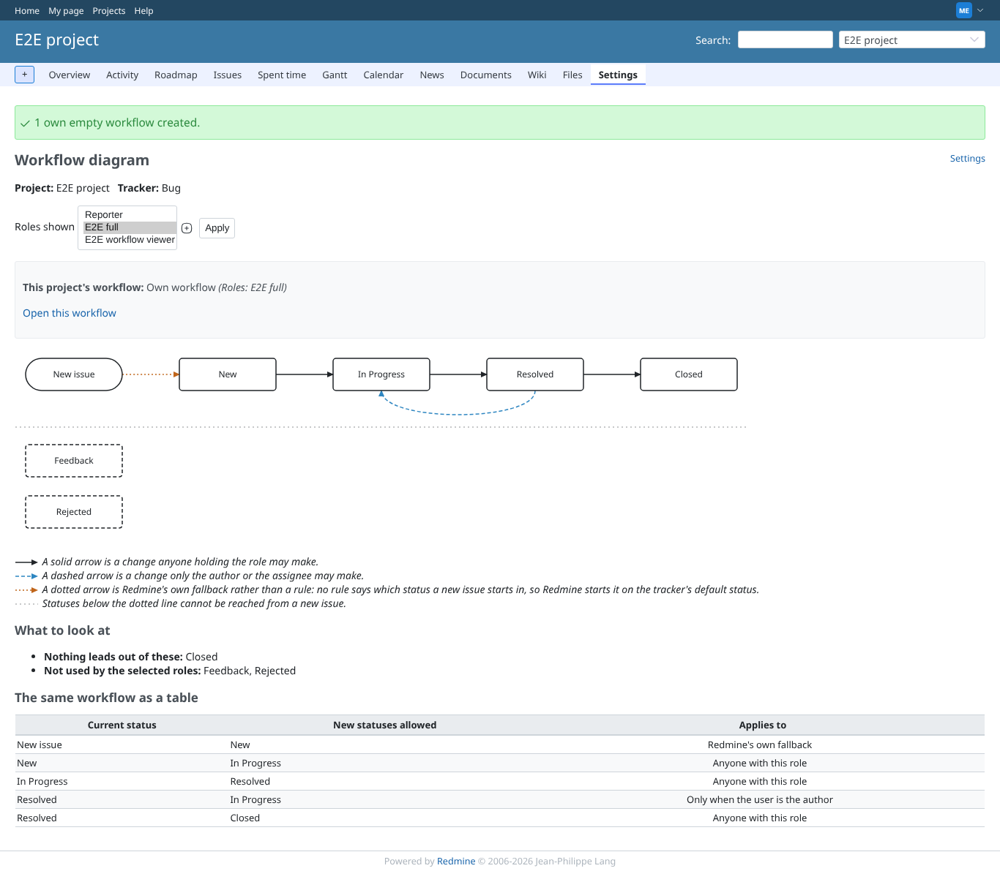
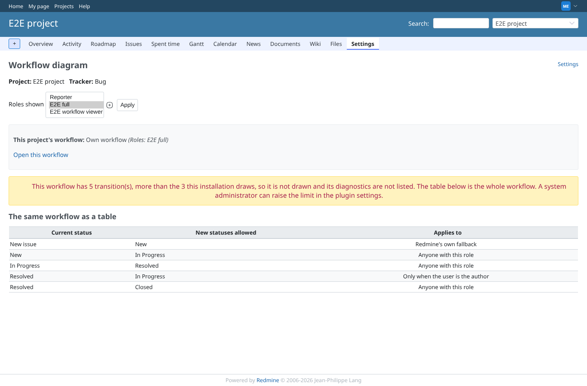
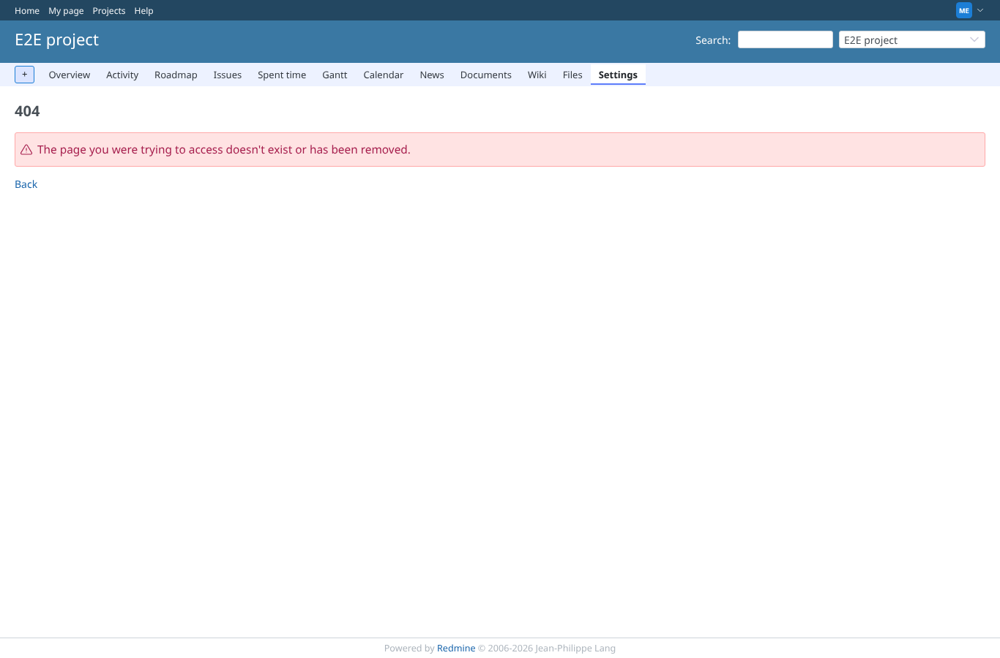
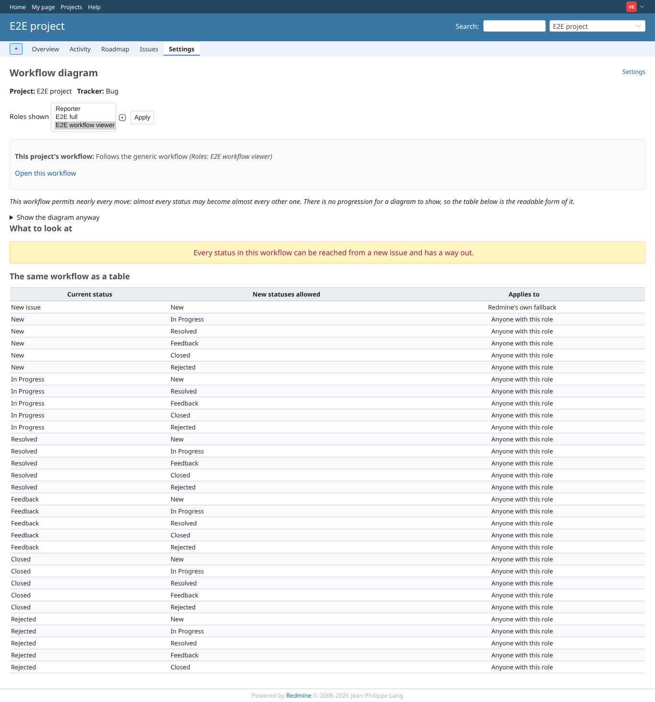

# diagram

Run 2026-10-06T20:27:30.976Z against http://127.0.0.1:3000.

| screenshot | user | URL | shows |
|---|---|---|---|
|  | manager | `/projects/e2e-project/workflow/graph?tracker_id=1&role_id[]=6` | Manager: the generic workflow permits nearly every move, so the drawing is folded away and the table is shown |
|  | manager | `/projects/e2e-project/workflow/graph?tracker_id=1&role_id[]=6` | Manager: own workflow drawn as a diagram, dashed author-only arrow, Rejected listed as unreachable |
|  | manager | `/projects/e2e-project/workflow/graph?tracker_id=1&role_id[]=6` | Manager: with graph_edge_ceiling = 3 the 5-arrow workflow is not drawn; the table remains |
|  | manager | `/projects/e2e-project/workflow/graph?tracker_id=1&role_id[]=6` | Manager: with the diagram switched off in the plugin settings, the page answers 404 |
|  | manager | `/projects/e2e-project/workflow/graph?tracker_id=999999&role_id[]=6` | Manager: a tracker id that names nothing answers 404 |
|  | viewer | `/projects/e2e-project/workflow/graph?tracker_id=1&role_id[]=7` | Viewer: the diagram for their own role |
|  | reporter | `/projects/e2e-project/workflow/graph?tracker_id=1&role_id[]=6` | Reporter (no plugin permission): the diagram answers 403 |
