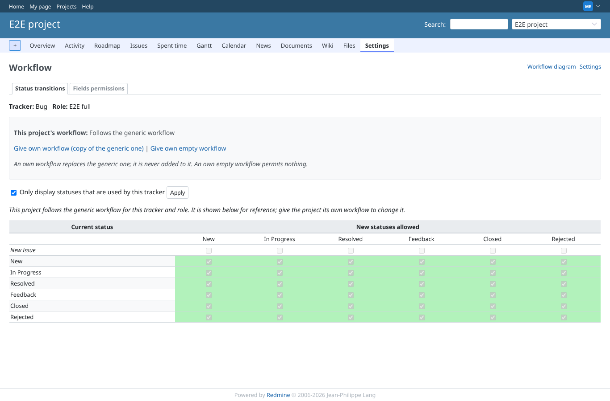
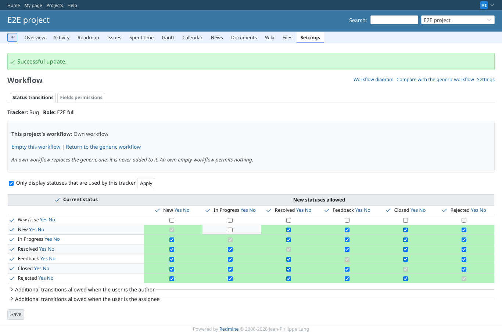
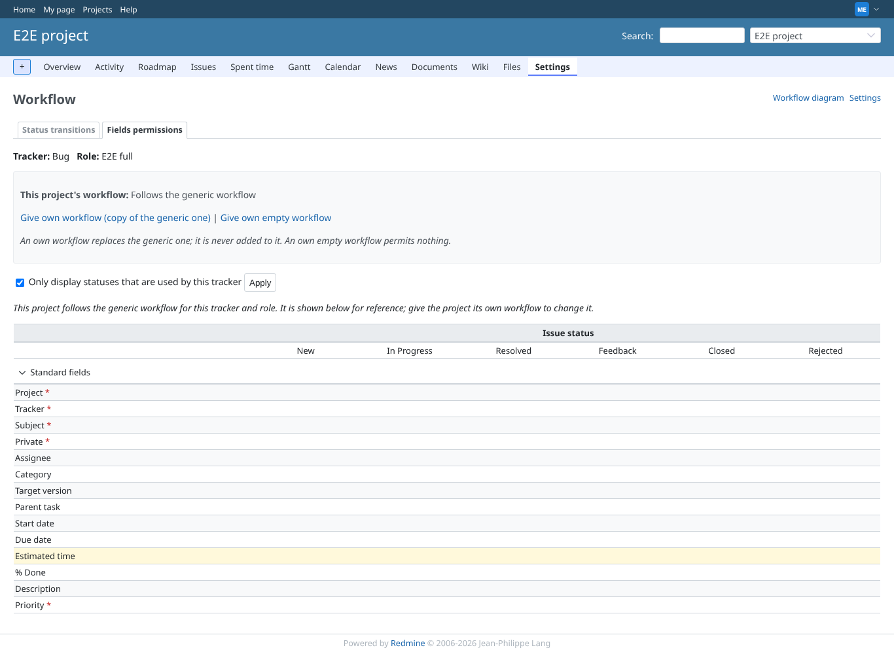
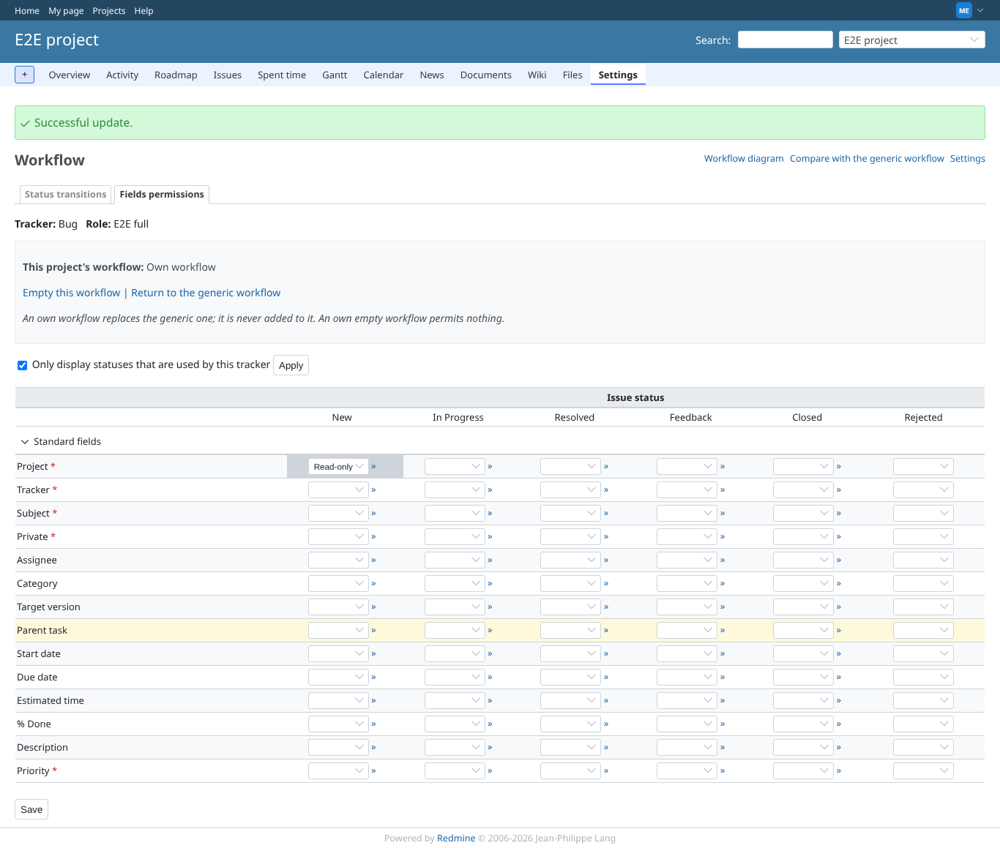
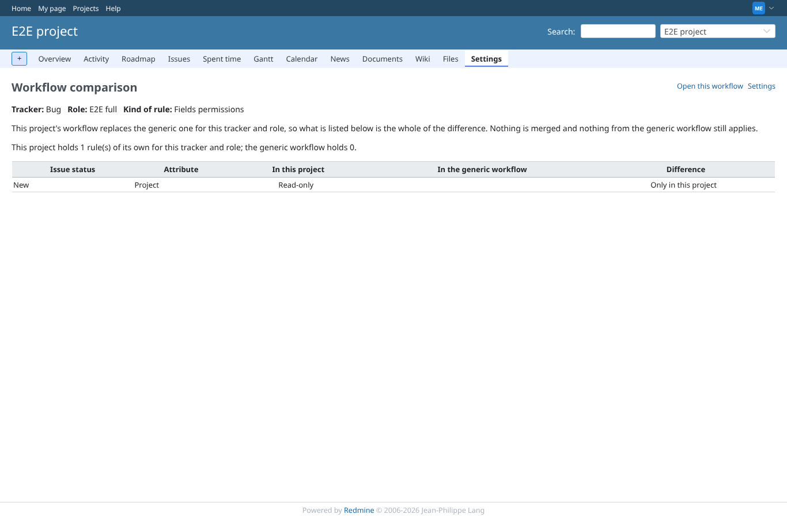
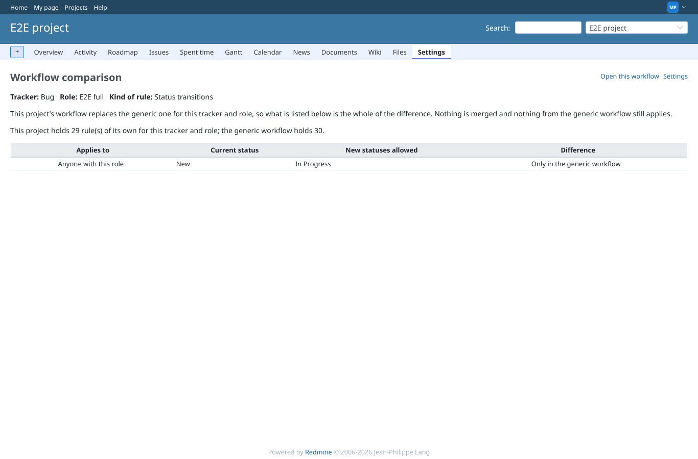
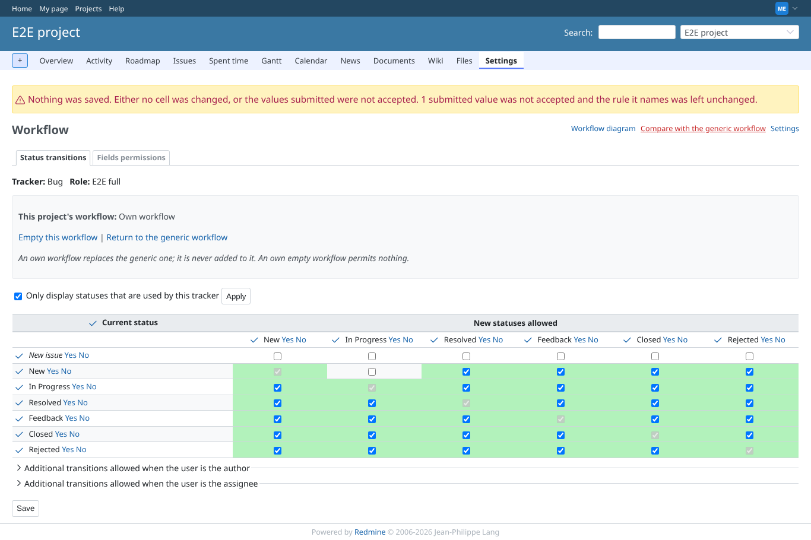
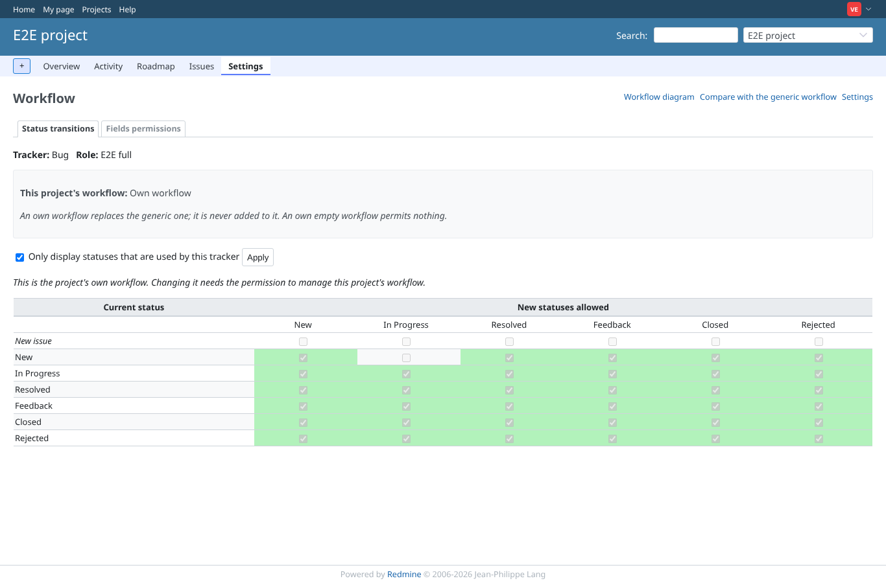

# project_matrix

Run 2026-10-06T19:38:23.708Z against http://127.0.0.1:3000.

| screenshot | user | URL | shows |
|---|---|---|---|
|  | manager | `/projects/e2e-project/workflow/transitions?tracker_id=1&role_id=6` | Manager: Bug x E2E full follows the generic workflow, so the matrix is read-only and shows the generic rules |
|  | manager | `/projects/e2e-project/workflow/transitions?role_id=6&tracker_id=1&used_statuses_only=` | Manager: own transitions matrix after Save, one rule removed, "Successful update" |
|  | manager | `/projects/e2e-project/workflow/permissions?tracker_id=1&role_id=6` | Manager: field permissions follow the generic workflow, read-only |
|  | manager | `/projects/e2e-project/workflow/permissions?role_id=6&tracker_id=1&used_statuses_only=` | Manager: own field permissions saved, project_id read-only |
|  | manager | `/projects/e2e-project/workflow/compare?role_id=6&rule_type=permissions&tracker_id=1` | Manager: comparison of own field permissions with the generic workflow |
|  | manager | `/projects/e2e-project/workflow/compare?tracker_id=1&role_id=6&rule_type=transitions` | Manager: the transition removed above is "Only in the generic workflow" |
|  | manager | `/projects/e2e-project/workflow/transitions?tracker_id=999999&role_id=6` | Manager: a tracker id that names nothing answers 404 |
|  | manager | `/projects/e2e-project/workflow/transitions?tracker_id=1&role_id=6` | Manager: after a forged save naming a status that does not exist, the screen says what happened and the matrix is unchanged |
|  | viewer | `/projects/e2e-project/workflow/transitions?tracker_id=1&role_id=6` | Viewer: the own workflow is shown read-only, no Save, no actions |
|  | reporter | `/projects/e2e-project/workflow/permissions?tracker_id=1&role_id=6` | Reporter (no plugin permission): the permissions matrix answers 403 |
