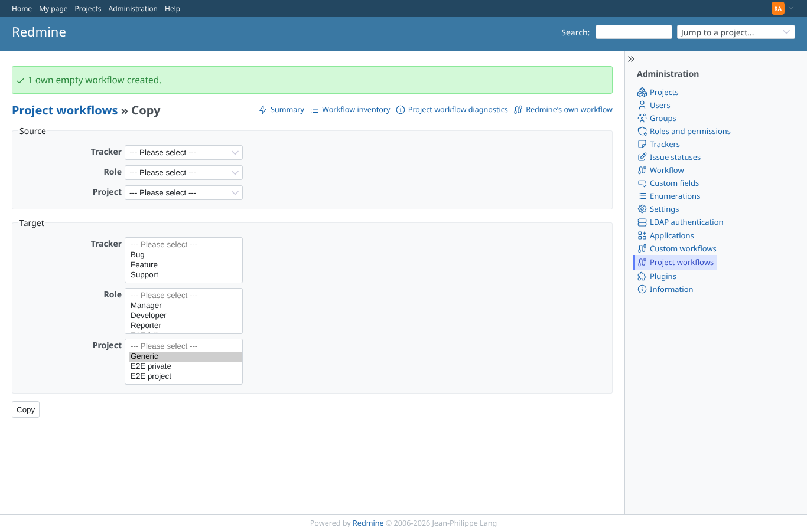
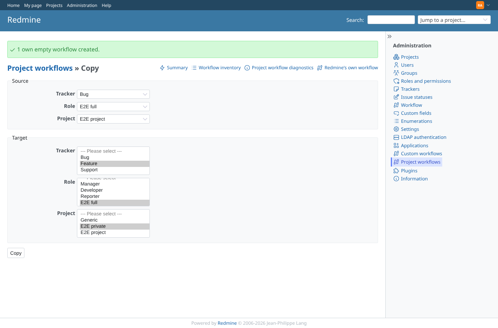
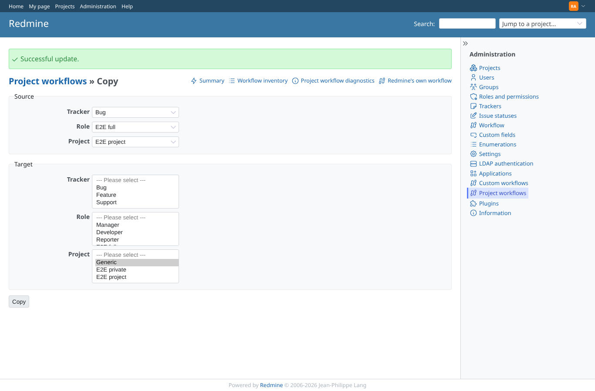
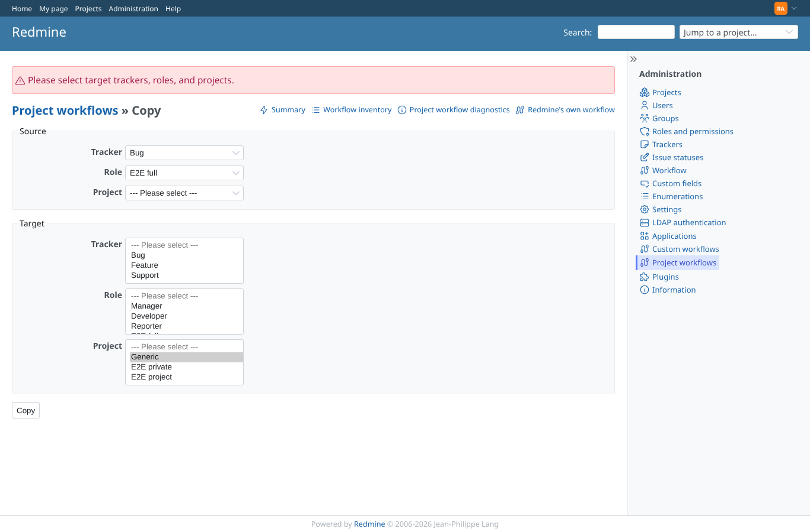
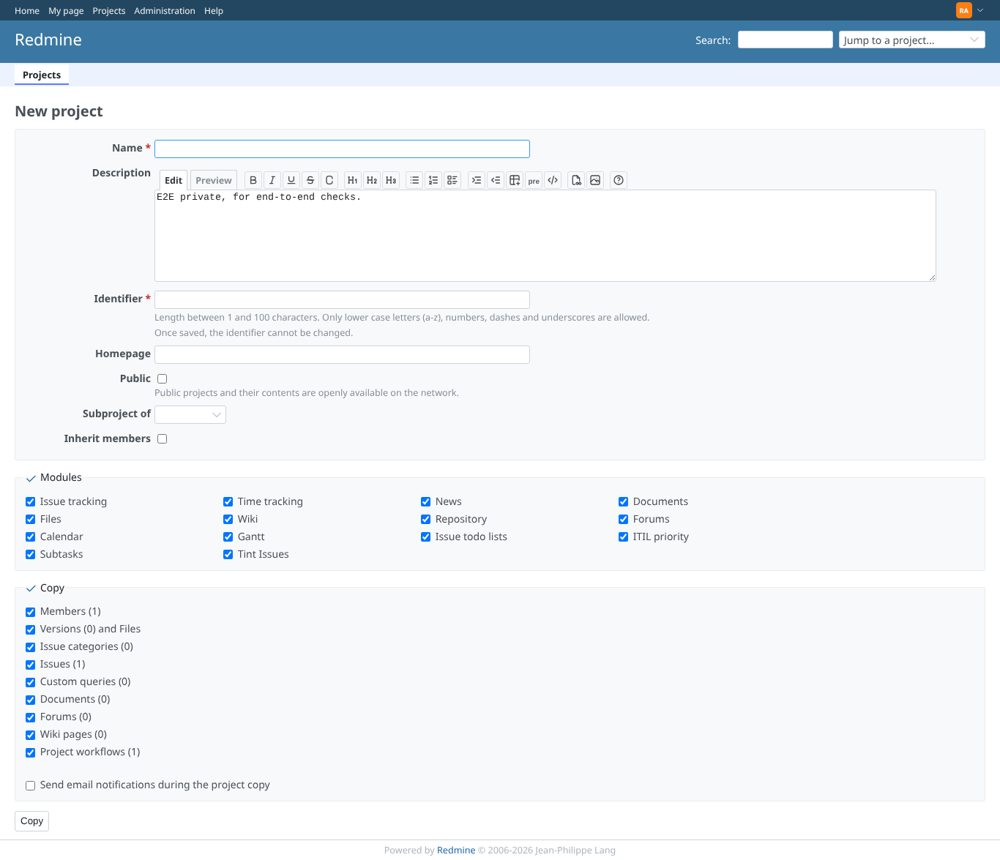
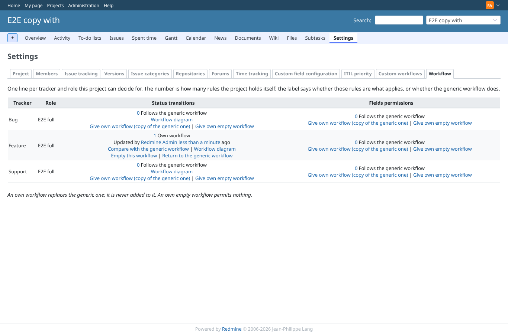

# copy_workflows

Run 2026-10-07T16:21:25.720Z against http://127.0.0.1:3000.

| screenshot | user | URL | shows |
|---|---|---|---|
|  | admin | `/project_workflow_rules/copy` | Admin: the Copy screen (source tracker, role, project; target trackers, roles, projects) |
|  | admin | `/project_workflow_rules/copy` | Admin: copy e2e-project Bug x E2E full onto e2e-private Feature x E2E full |
|  | admin | `/project_workflow_rules/copy?source_project_id=1&source_role_id=6&source_tracker_id=1` | Admin: after Copy, the success message; e2e-private Feature x E2E full holds the copied rule |
|  | admin | `/project_workflow_rules/duplicate` | Admin: a copy without a target tracker or role is refused with a message |
|  | admin | `/projects/e2e-private/copy` | Admin: Copy project lists "Project workflows (1)", ticked by default |
|  | admin | `/projects/e2e-copy-with/settings/project_workflows` | Admin: the copied project has the own workflow for Feature x E2E full |
|  | manager | `/project_workflow_rules/copy` | Manager: the Copy screen answers 403 |
