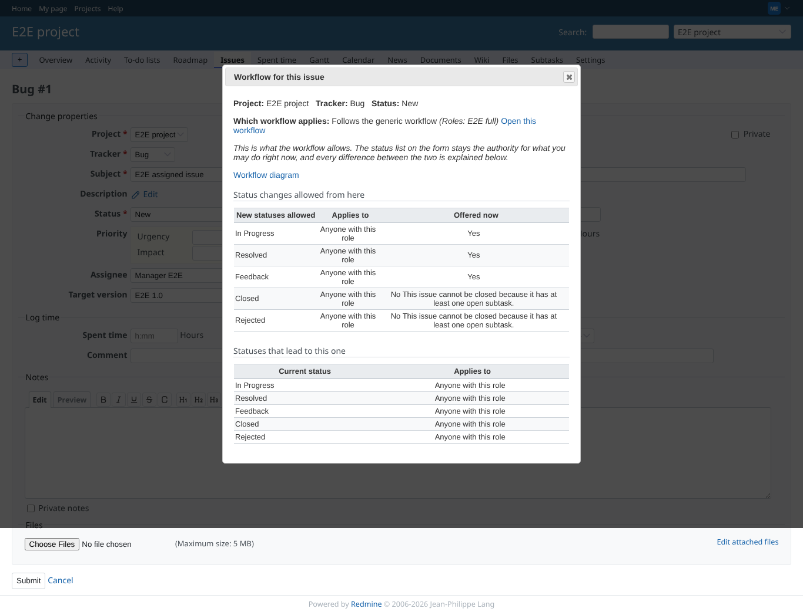
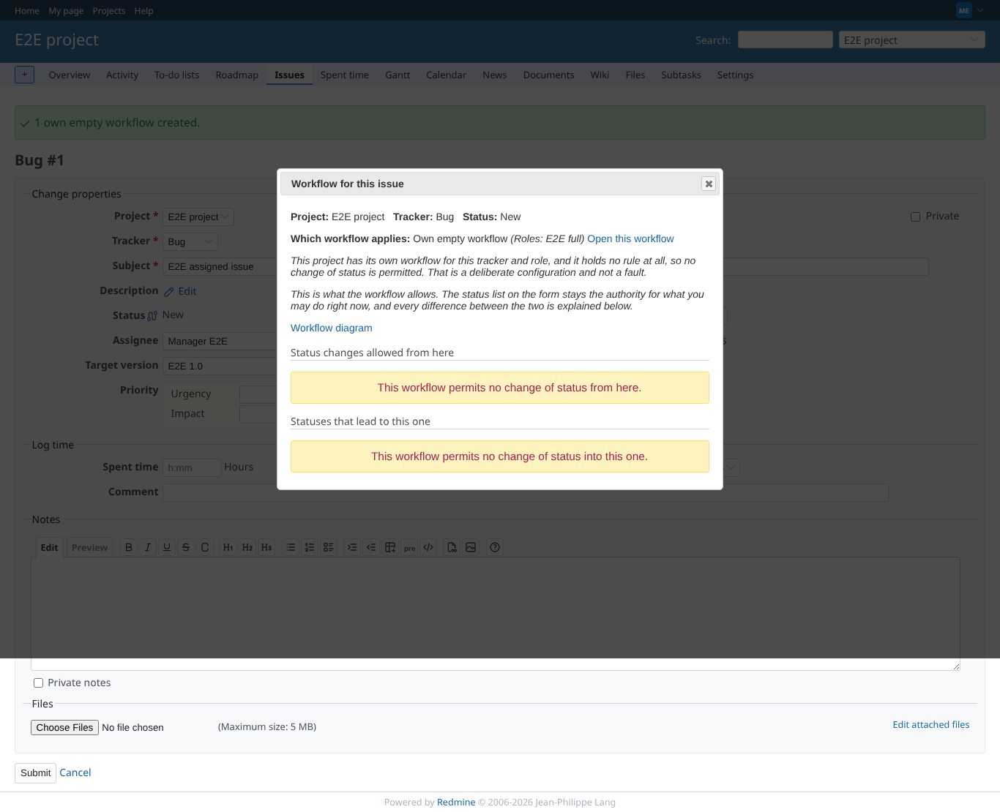
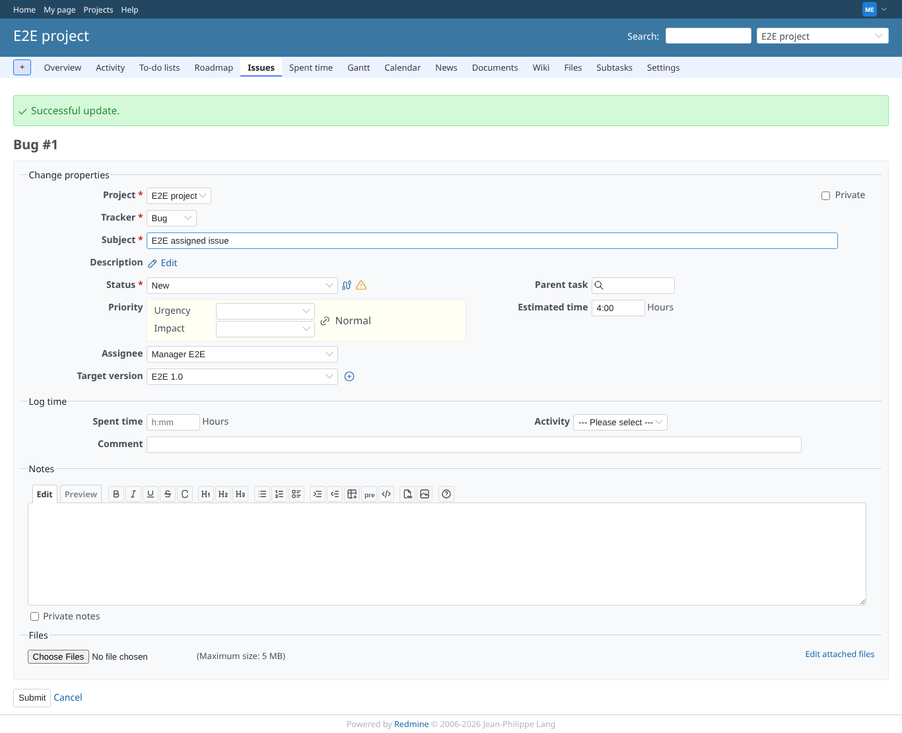
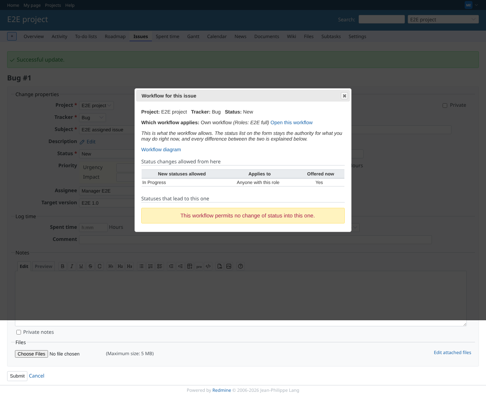
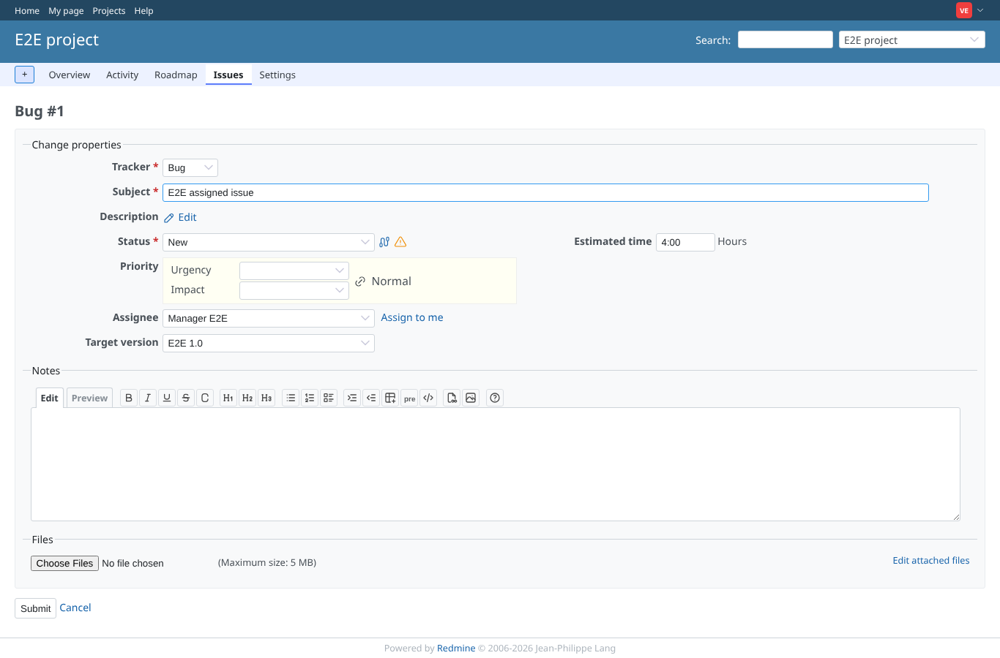
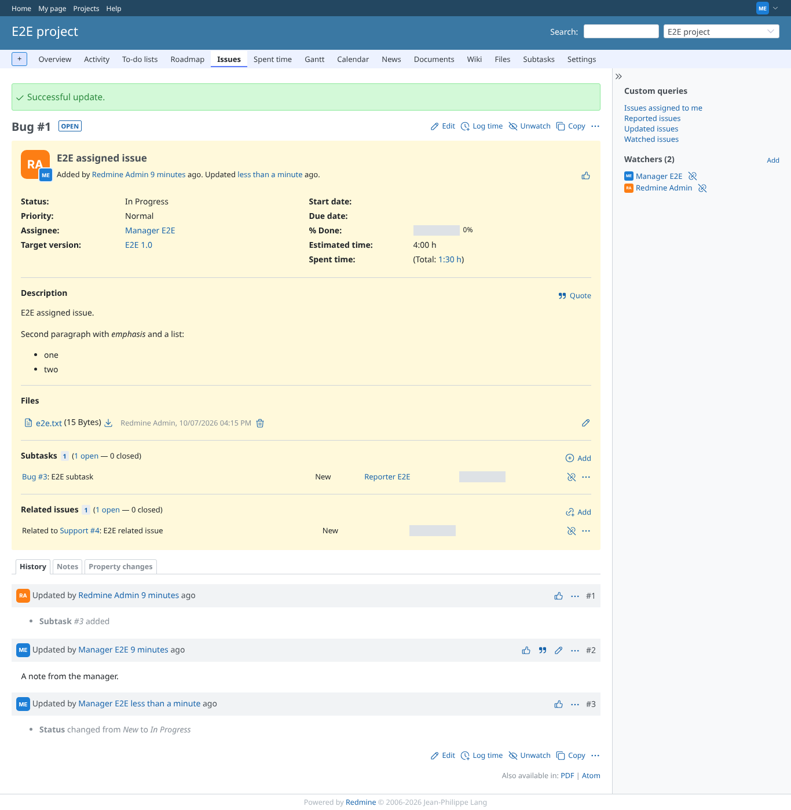
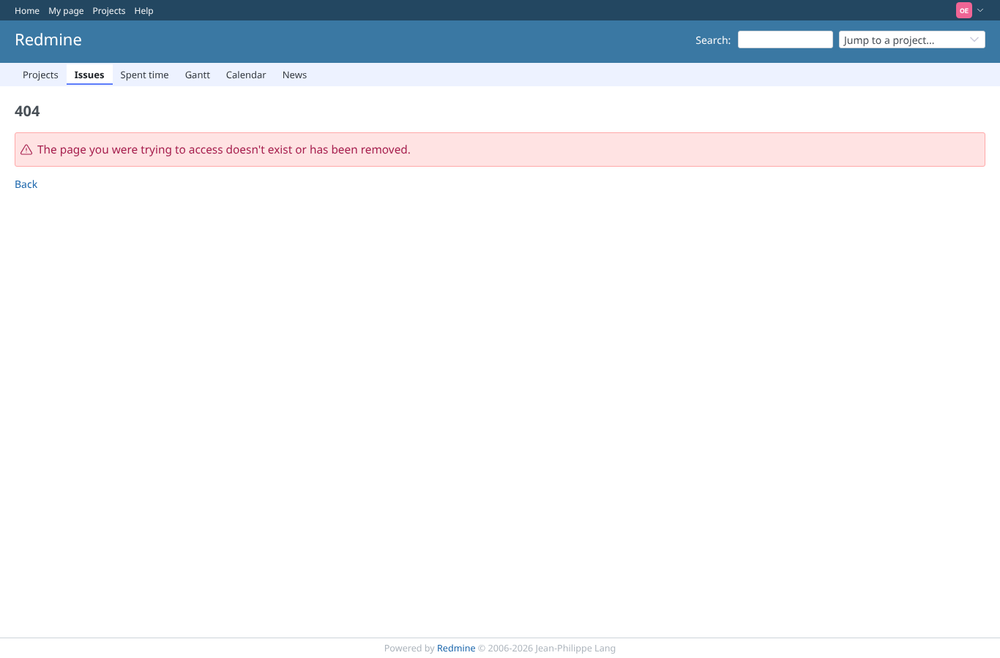

# issue_effect

Run 2026-10-07T16:24:39.200Z against http://127.0.0.1:3000.

| screenshot | user | URL | shows |
|---|---|---|---|
|  | manager | `/issues/1/edit` | Manager: "Workflow for this issue" says the project follows the generic workflow |
|  | manager | `/issues/1/edit` | Manager: own EMPTY workflow, no status field; the panel says why |
|  | manager | `/issues/1/edit` | Manager: own workflow with one rule, the status list offers New and In Progress only |
|  | manager | `/issues/1/edit` | Manager: the panel lists the one permitted change |
|  | viewer | `/issues/1/edit` | Viewer (role E2E workflow viewer): the project workflow for E2E full does not narrow another role |
|  | manager | `/issues/1` | Manager: the issue moved New -> In Progress under the project workflow |
|  | outsider | `/issues/6/workflow_map?tracker_id=1` | Outsider: the panel of an issue in the private project answers 404 |
