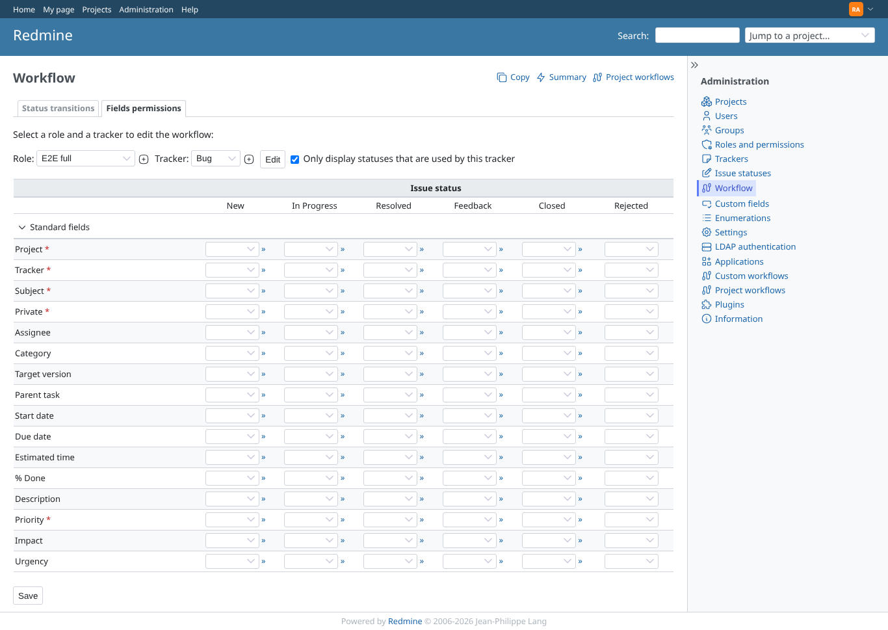
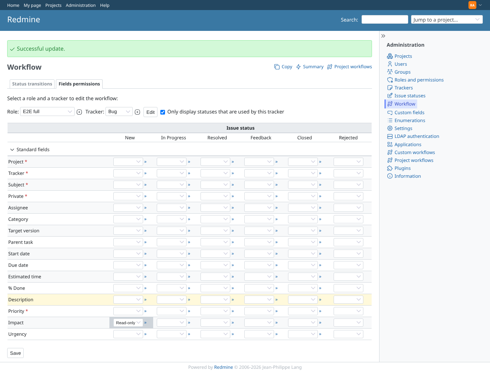

# neighbour_field_permissions

Run 2026-10-07T16:49:40.577Z against http://127.0.0.1:3000.

| screenshot | user | URL | shows |
|---|---|---|---|
|  | admin | `/workflows/permissions?role_id[]=6&tracker_id[]=1` | Admin: core Fields permissions with redmine_itil_priority installed shows the Impact and Urgency rows again |
|  | admin | `/workflows/permissions?role_id[]=6&tracker_id[]=1` | Admin: Impact read-only for New saved on the generic workflow and shown back |
|  | outsider | `/workflows/permissions?role_id[]=6&tracker_id[]=1` | Outsider (after manager and reporter, same answer): core Fields permissions answers 403 |
