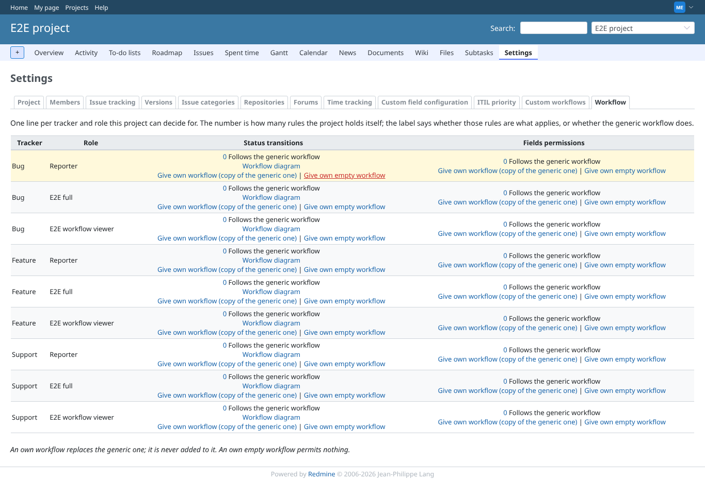
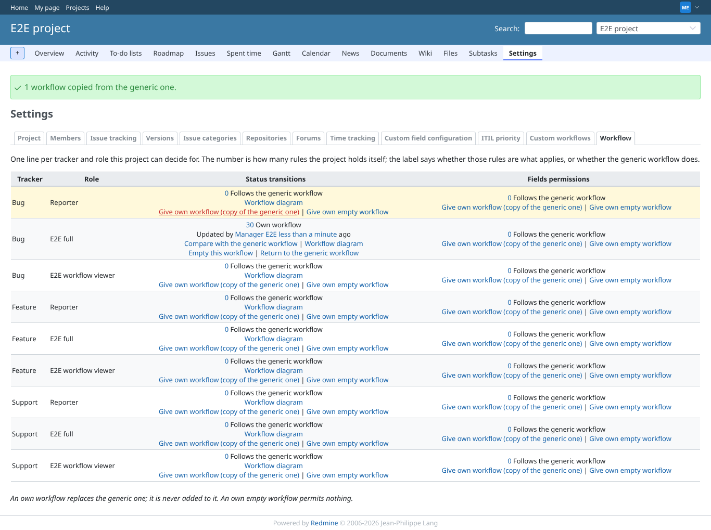
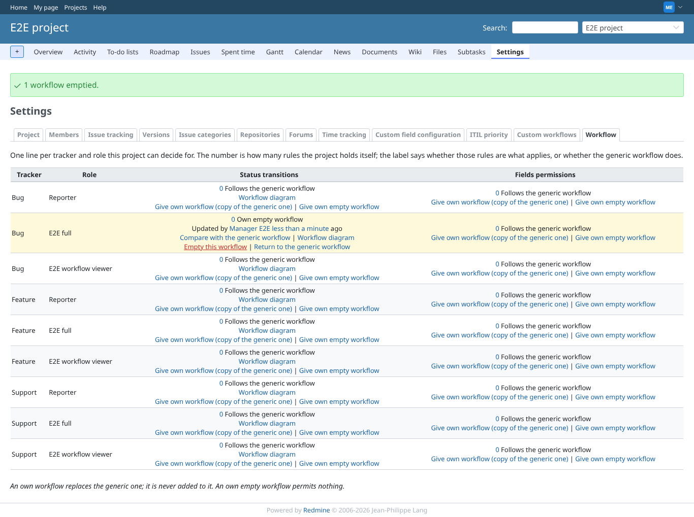
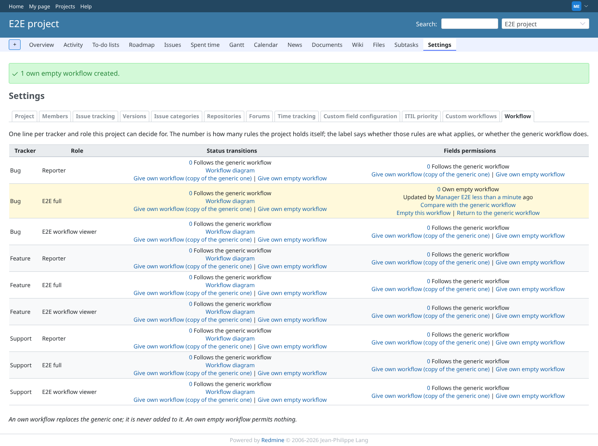
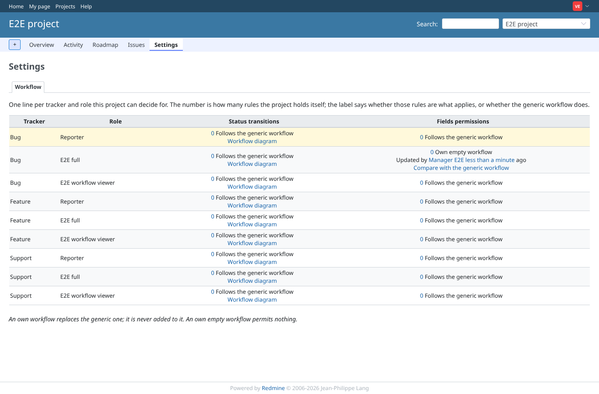
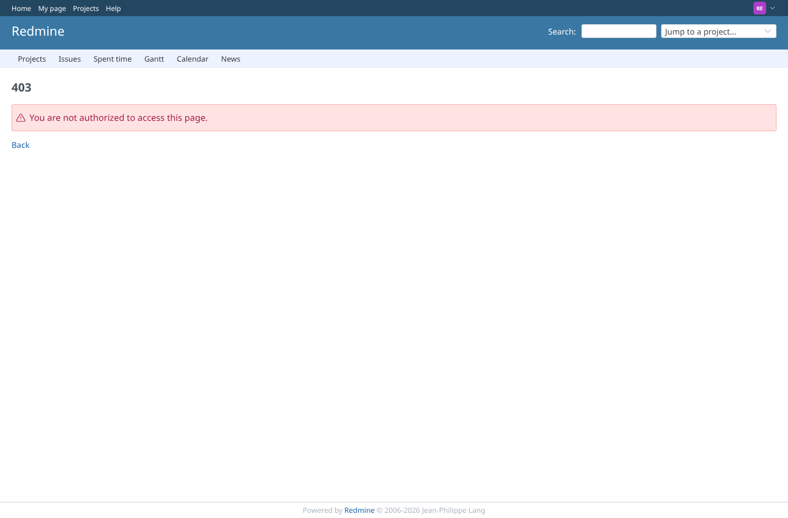
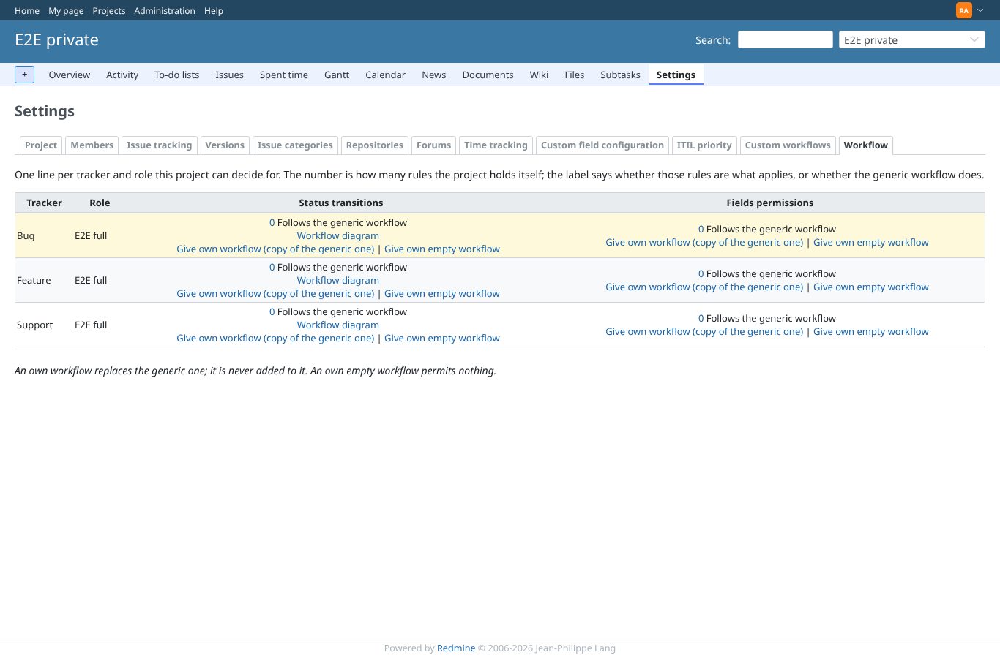

# project_settings_tab

Run 2026-10-07T16:28:02.827Z against http://127.0.0.1:3000.

| screenshot | user | URL | shows |
|---|---|---|---|
|  | manager | `/projects/e2e-project/settings?tab=project_workflows` | Manager: the Workflow tab, every combination follows the generic workflow, actions offered |
|  | manager | `/projects/e2e-project/settings/project_workflows` | Manager: Bug x E2E full transitions taken over as a copy; the cell offers Empty and Return |
|  | manager | `/projects/e2e-project/settings/project_workflows` | Manager: after Empty the combination is an own EMPTY workflow, distinct from inheriting |
|  | manager | `/projects/e2e-project/settings/project_workflows` | Manager: field permissions given an own empty workflow directly |
|  | viewer | `/projects/e2e-project/settings?tab=project_workflows` | Viewer (view permission only): the tab is shown read-only, no actions |
|  | reporter | `/projects/e2e-project/settings` | Reporter (no plugin permission, no project settings): project settings refused |
|  | reporter | `/projects/e2e-project/workflow/transitions?tracker_id=1&role_id=6` | Reporter: the project matrix URL answers 403 |
|  | outsider | `/projects/e2e-private/workflow/transitions?tracker_id=1&role_id=6` | Outsider: the private project and its workflow are refused |
|  | admin | `/projects/e2e-private/settings?tab=project_workflows` | Admin: the Workflow tab of the private project |
