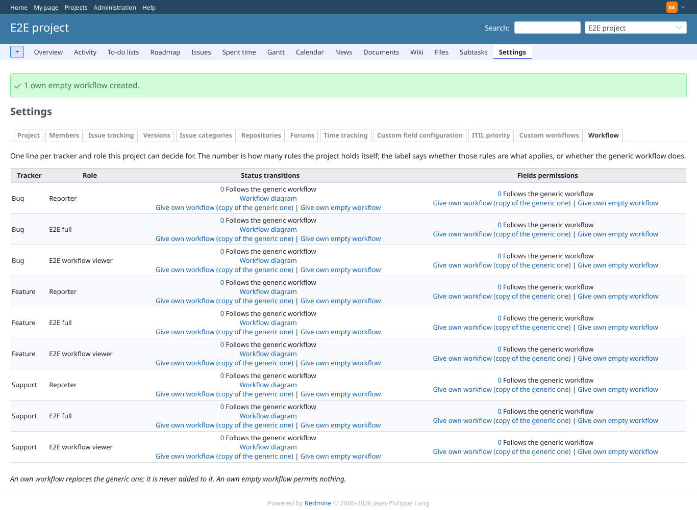
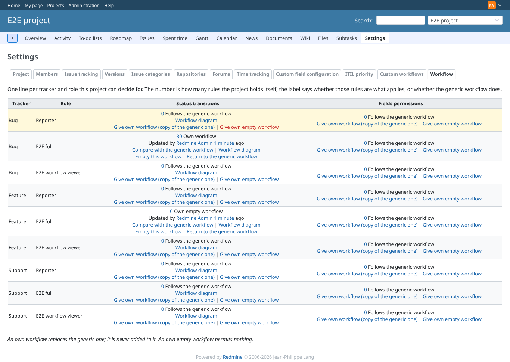

# rake_tasks

Run 2026-10-07T16:30:01.591Z against http://127.0.0.1:3000.

| screenshot | user | URL | shows |
|---|---|---|---|
|  | admin | `/projects/e2e-project/settings/project_workflows` | Admin: the project workflows are gone (every row follows the generic workflow) |
|  | admin | `/projects/e2e-project/settings/project_workflows` | Admin: after rake redmine_project_workflows:restore, the own workflow and the own EMPTY workflow are back |
|  | admin | `/projects/e2e-project/settings/project_workflows` | Admin: after the refused uninstall the plugin and its workflows are intact |
