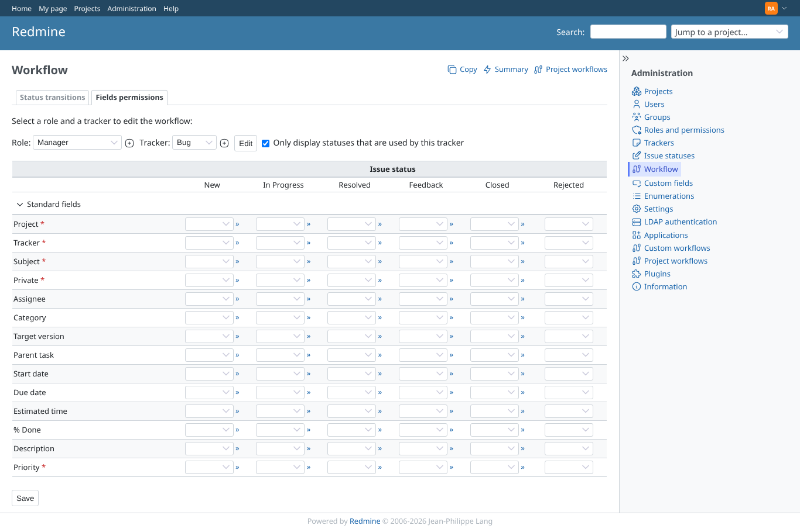

# together-itil

Run 2026-10-06T20:45:53.705Z against http://127.0.0.1:3000.

| screenshot | user | URL | shows |
|---|---|---|---|
|  | admin | `/workflows/permissions?role_id[]=3&tracker_id[]=1` | Combined host with redmine_itil_priority: core Fields permissions has no Impact/Urgency rows (finding C2) |
