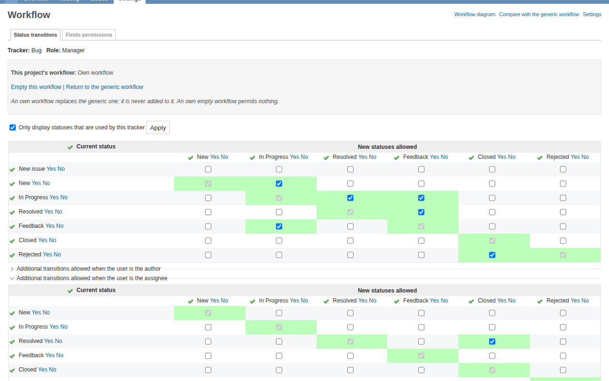
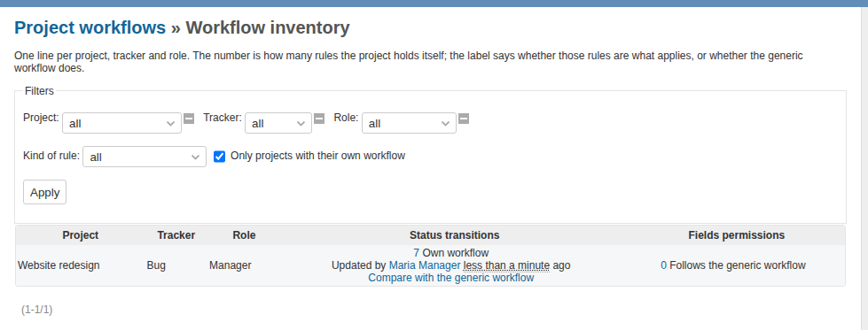
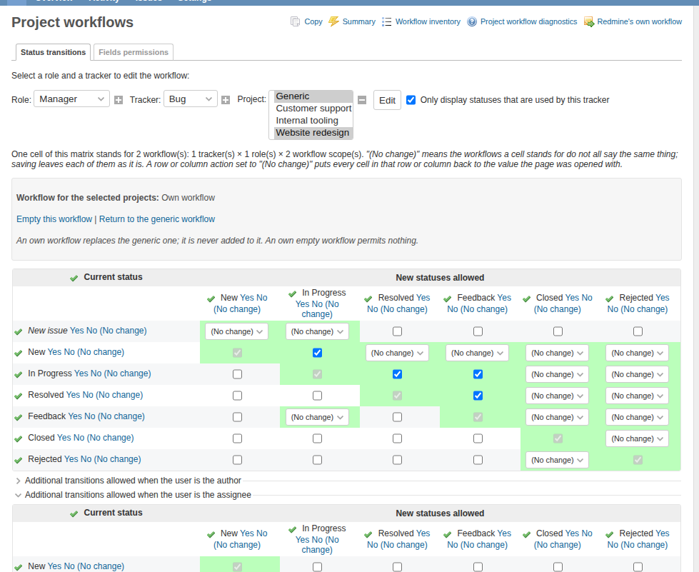
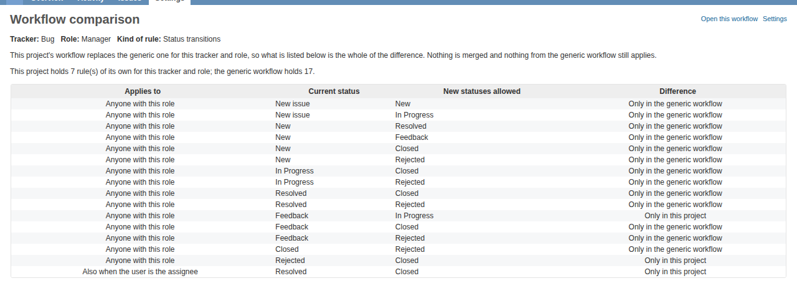
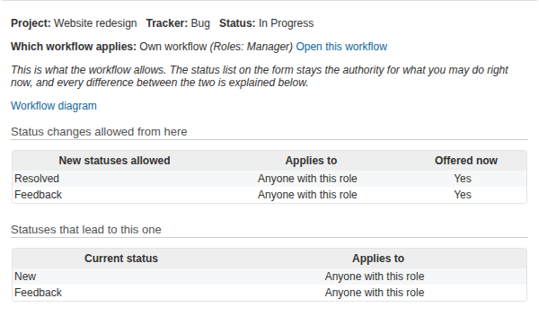

# Using it

The plugin adds two things: an administration area for editing many projects'
workflows at once, and a **Workflow** tab in project settings so a project can
manage its own without an administrator.

- [The three states](#the-three-states)
- [Project settings → Workflow](#project-settings--workflow)
- [Administration → Project workflows](#administration--project-workflows)
- [Editing several workflows at once](#editing-several-workflows-at-once)
- [Filling a matrix in fewer clicks](#filling-a-matrix-in-fewer-clicks)
- [Comparing with the generic workflow](#comparing-with-the-generic-workflow)
- [The workflow diagram](#the-workflow-diagram)
- [On the issue form](#on-the-issue-form)
- [Copying a workflow to other projects](#copying-a-workflow-to-other-projects)

## The three states

For each combination of project, tracker and role, exactly one of these is true:

| State | What it means |
|---|---|
| **Follows the generic workflow** | Nothing is stored for this project. It uses the workflow every project shares. |
| **Own workflow** | The project has its own rules, and only those apply. |
| **Own empty workflow** | The project has its own workflow and it is empty, so nothing is permitted. |

Two rules follow from this and are worth learning before anything else.

**An own workflow replaces the generic one.** It is never added to it. Once a
project has taken a combination over, the generic rules for that combination do
not apply at all, including for the transitions the project did not mention.

**Nothing is inherited between projects.** A subproject does not get its parent's
workflow. It either has its own or follows the generic one.

Because a project workflow replaces rather than extends, *Give own workflow*
starts from a copy of the generic one. The empty variant is a separate action,
and it is deliberate: an own empty transitions workflow means no issue in that
project can change status for that role.

## Project settings → Workflow

Anyone with one of the plugin's two permissions gets this tab. It lists one line
per tracker the project has enabled and role somebody holds in it.

Each line shows the state, how many rules the project holds itself, and the
actions that change it. Click the number to open that combination's matrix.

Three things to know:

- **One combination at a time.** The project matrix edits one tracker and one
  role. The administration screens are where you edit many at once.
- **A combination the project has not taken over is read-only** and shows the
  generic workflow, so you can see what you would be copying.
- **The built-in roles are not offered here.** *Non member* and *Anonymous* have
  no members in any project. An administrator can still give a project its own
  workflow for them from the administration area; if one has, the row does
  appear, so the project can see it and hand it back.

### The two permissions

Under *Issue tracking* in **Administration → Roles**:

| Permission | What it allows |
|---|---|
| **View the project's workflow** | Read the tab, the matrices, the comparison and the diagram. |
| **Manage the project's workflow** | Take a workflow over, edit it, empty it, and return it to the generic one — for that project only. |

Editing a project's own matrix looks like Redmine's own workflow grid, with a
panel above it saying which state you are in:

## Administration → Project workflows

This is the plugin's own screen. Redmine's **Administration → Workflow** is
unchanged and still edits the workflow every project shares; it carries a link
across to this one.

It has four screens: **Summary**, the transitions and field permissions
matrices, and **Copy**. Next to them are links to the **Workflow inventory** and
to **Diagnostics**.

The inventory answers the question the summary grid cannot — which projects have
taken a workflow over:

It shows only the projects that decided something unless you ask for everything.

> Earlier alpha releases put the project controls on Redmine's own workflow
> screens. If you have a bookmark to one of those with a project in its address,
> the project part is now ignored. Use **Administration → Project workflows**.

## Editing several workflows at once

The administration matrices take a selection: several trackers, several roles
and several projects, with **Generic** as one more entry in that list.

Archived projects are not offered, and *(All)* means every project that is not
archived. A workflow written for an archived project governs nothing, since
nobody but an administrator can reach it. If an archived project already has one,
the inventory still reports it and its link still opens the matrix.

What the selection means when you save:

- **Cells you leave alone stay alone.** A cell whose value differs across the
  selection carries a *(No change)* option, and saving with it selected leaves
  each of those workflows as it was. On the transitions matrix such a cell
  becomes a dropdown where an agreeing cell is a checkbox, so you can see which
  cells disagree at a glance.
- **Cells you change are written to all of them.** One click with three trackers,
  two roles and ten projects selected writes sixty workflows. A sentence above
  the matrix gives that number for your selection.
- **Saving does not give a project a workflow of its own.** Only the three state
  actions do that. A combination that still follows the generic workflow shows an
  empty matrix, and Save leaves it alone rather than writing that emptiness back.
  A message after the save says how many it left alone.
- **The state actions act only where they mean something.** *Give own workflow*
  touches only combinations that currently follow the generic one, so pressing it
  twice does not discard the first result.
- **Generic is not a project.** It can be edited as one more member of the
  selection, but it cannot be given its own workflow, emptied or handed back — it
  *is* what the others fall back to.

## Filling a matrix in fewer clicks

Every row and column of a transition matrix carries **Yes**, **No** and
**(No change)** next to its name, which set that whole row or column at once.

Redmine's own check-all toggle still works as before. What it never reached is a
cell whose value differs across the selection: that renders as a dropdown rather
than a checkbox, and a toggle that selects checkboxes skips exactly the cells
with the manual work in them. These three actions reach both kinds.

**(No change)** appears only when the selection covers more than one workflow. It
puts each cell back to the value the page was opened with.

Nothing is written until you press **Save**. Once you have used a row or column
action, a line above the matrix says how many cells changed, how many workflow
rules that stands for, and offers **Undo**. Undo steps back one action at a time
and restores the value each cell held before that action.

## Comparing with the generic workflow

From the Workflow tab, from either project matrix, and from the inventory,
**Compare with the generic workflow** lists exactly which rules differ for one
tracker, one role and one kind of rule.

Each line says which side it is on: *Only in this project*, *Only in the generic
workflow*, or, for field permissions, *Different* with both values. There is no
"wins" column, because there is no contest — an own workflow replaces the generic
one entirely.

A combination the project has not taken over says there is nothing to compare.
One whose rules happen to match the generic ones says so rather than showing an
empty table.

Beside the state, **Updated by … ago** says who last changed those rules. The
date the decision was taken is kept separately from the date the rules last
changed, so re-saving a matrix does not look like a fresh decision.

## The workflow diagram

**Workflow diagram**, from the Workflow tab, the top of both matrices and the
issue-form panel, draws a project's status transitions for one tracker.

Redmine decides its workflow per tracker *and per role*, so the diagram has a
**Roles shown** selector and starts on the roles you hold in that project.
Picking *Developer* answers "what may a developer actually do here".

Under the drawing, in words:

- **Cannot be reached from a new issue** — a status no sequence of permitted
  moves leads to. Drawn below a dotted line rather than in the flow.
- **Nothing leads out of these** — a status an issue can enter and never leave.
  Sometimes a deliberate terminal *Closed*; sometimes a rule somebody forgot.
- **Not used by the selected roles** — a status the tracker's workflow uses under
  some other role.

Three kinds of arrow, and a legend that names the ones actually on the page:

| | |
|---|---|
| **Solid** | A change anyone holding the role may make. |
| **Dashed** | A change only the author or the assignee may make. |
| **Dotted** | Redmine's own fallback rather than a rule — see below. |

A status in a dashed box below the dotted line cannot be reached from a new
issue. The drawing uses line style rather than colour on purpose: a Redmine theme
changes exactly the colours a diagram would otherwise hard-code, and a black
stroke on a dark theme is invisible. Everything the picture distinguishes, the
legend also says in words.

Underneath is the same workflow as a table, which is what a screen reader reads,
what Ctrl-F finds and what prints legibly.

Two details:

- **The dotted arrow.** A stock Redmine has no rule in the *New issue* row, and
  creates issues anyway: with no rule, a new issue starts on the tracker's
  default status. The diagram draws that as a dotted arrow so those statuses are
  correctly reported as reachable. Add a *New issue* rule and it disappears.
- **A workflow that permits nearly everything is not drawn by default.** Redmine's
  default workflow lets every status become every other one, and a line between
  every pair of boxes answers nothing. The page says so and folds the picture
  away behind *Show the diagram anyway*. The table and the lists stay.

The diagram is behind the **View the project's workflow** permission, because it
shows what other roles may do. It draws transitions only: field permissions are a
property of a status rather than of a move, so the comparison screen is where
those are read side by side.

## On the issue form

Two things sit next to the status list when you create or edit an issue.

**Redmine's own help icon** lists every status you may pick with the description
an administrator wrote for it. That is core's, and the plugin makes it correct:
the list is your project's effective workflow, never another project's. It stays
invisible until somebody fills those descriptions in at **Administration → Issue
statuses**, which is worth doing once.

**Workflow for this issue** is the plugin's, and answers what the status list
cannot:

- **Which workflow applies**, in the same three words used everywhere else, with
  one line per role you hold.
- **Status changes allowed from here**, with what each requires — anyone with the
  role, only the author, only the assignee — and whether the status list is
  offering it right now.
- **Statuses that lead to this one**, so "how did this issue get here" is
  answerable.

The panel says what the workflow allows. The status list stays the authority for
what you may do this minute, and every difference between the two carries its
reason: Redmine withholds a closed status from an issue with an open subtask, for
instance, and the panel shows Redmine's own sentence for it.

The case it exists for: a project with an **own empty workflow** permits nothing,
and Redmine's response is not an empty dropdown but *no status control at all*,
with nothing to say why. Redmine does the same without this plugin for any status
with nothing leading out of it. So the link is there whenever the status list is
not, which is where it is needed most.

It costs nothing until you open it — the form gets a link, and the panel loads
when you click it. It is on the single-issue forms only, not on bulk edit, where
a selection can span projects and trackers.

## Copying a workflow to other projects

**Administration → Project workflows → Copy** applies one workflow to several
projects at once: pick a source tracker, role and project (or the generic
workflow), then the targets.

Copying a project in Redmine also copies its workflow. *Copy project* offers
**Project workflows (N)** among *Members*, *Issues* and the rest, ticked like all
of them; the number counts what would come across. Untick it and the copy starts
from the generic workflow. A copy into a project that already runs its own
workflow leaves that project's decisions alone.
